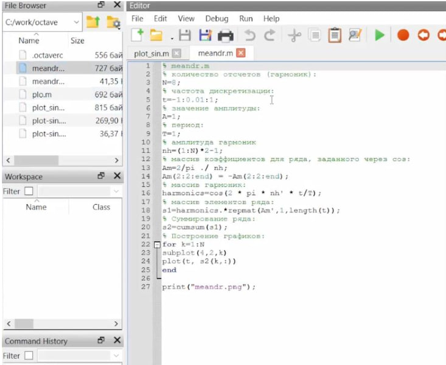
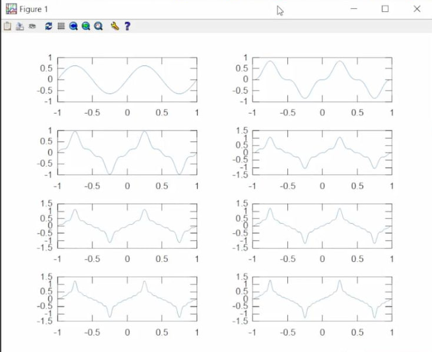
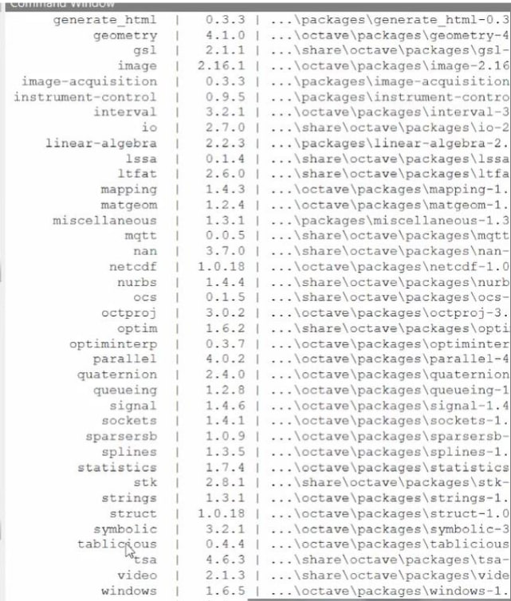
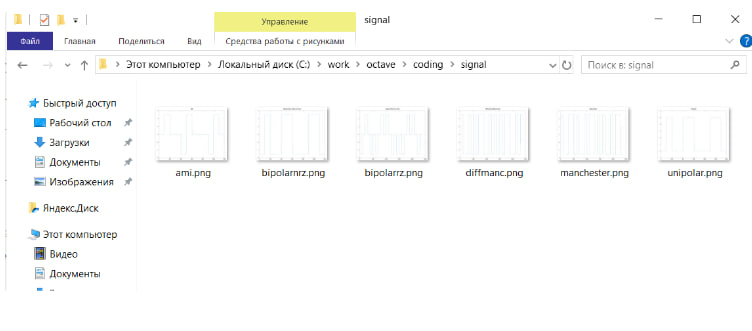

---
# Preamble

## Author
author:
  name: Жаворонков Кирилл Александрович
## Title
title: Отчет по лабораторной работе № 1
subtitle: Сетевые технологии
license: CC BY
date: 2025-09-05

## Generic options
lang: ru-RU
crossref:
  lof-title: Список иллюстраций
  lot-title: Список таблиц
  lol-title: Листинги

## Fonts
mainfont: PT Serif
romanfont: PT Serif
sansfont: PT Sans
monofont: PT Mono
mainfontoptions: Ligatures=TeX
romanfontoptions: Ligatures=TeX
sansfontoptions: Ligatures=TeX,Scale=MatchLowercase
monofontoptions: Scale=MatchLowercase,Scale=0.9

## Formats
format:
  ### Pdf output format
  beamer:
    toc: true
    toc-title: Содержание
    number-sections: true
    colorlinks: false
    toc-depth: 2
    slide_level: 2
    aspectratio: 169
    section-titles: true
    theme: metropolis
    themeoptions: progressbar=frametitle,sectionpage=progressbar,numbering=fraction
    pdf-engine: xelatex
    fontenc: T2A
    #### Language
    babel-lang: russian
    babel-otherlangs: english

  ### Html output
  revealjs:
    transition: slide
    margin: 0.2
    smaller: false
    output-ext: html
    theme: beige
    logo: _resources/image/logo_rudn.png
---

## Цель работы

Изучение методов кодирования и модуляции сигналов с помощью высокоуровнего языка программирования Octave. Определение спектра и параметров
сигнала. Демонстрация принципов модуляции сигнала на примере аналоговой
амплитудной модуляции. Исследование свойства самосинхронизации сигнала.

# Выполнение работы

## Программа plot_sin.m

Запустим Octave с оконным интерфейсом. Перейдем в окно редактора. Создадим новый сценарий. Сохраним его в рабочий каталог с именем. В окне редактора повторим листинг по построению графика функции (рис. 1).

## Программа plot_sin.m

{#fig:001 width=70%}

## Программа plot_sin.m

Запустим сценарий. В качестве результата выполнения кода открылось окно с построенным графиком (рис. 2) и в рабочем
каталоге появились файлы с графиками в форматах .eps, .jpg.

## Построенный график

{#fig:002 width=70%}

\begin{figure}[h]
\centering
\framebox[0.8\textwidth]{\footnotesize Рисунок 3 пропущен}
\caption{Пропущенный рисунок}
\label{fig:003}
\end{figure}

## График с cos

Сохраним сценарий под другим названием и изменим его так, чтобы на одном графике располагались отличающиеся по типу линий графики функций (рис. 4)

## График с cos

{#fig:004 width=70%}

## Разложение импульсного сигнала в частичный ряд Фурье

Создадим новый сценарий и сохраним его в рабочий каталог с именем meandr.m. В коде повторим листинг по построению графиков меандра. (рис. 5)

{#fig:005 width=70%}

## Файл jpg

Экспортируем полученный график в файл в формате .jpg. (рис. 6)

{#fig:006 width=70%}

## Меандр через синусы

Скорректируем код для реализации меандра через синусы. Получим графики. (рис. 7)

{#fig:007 width=70%}

## График сигналов разной частоты

Создадим каталог spectre1 и в нём новый сценарий с именем, spectre.m. В коде повторим листинг по построению сигналов разной частоты. (рис. 8)

{#fig:008 width=70%}

## График спектра сигнала

Добавим код для нахождения спектров сигналов с помощью быстрого преобразования Фурье и получим график. (рис. 9)

{#fig:009 width=70%}

## Скорректированный график спектра

Скорректируем график спектра: отбросим дублирующие отрицательные частоты, а также примем в расчёт то, что на каждом шаге вычисления быстрого преобразования Фурье происходит суммирование амплитуд сигналов. (рис. 10)

## Скорректированный график спектра

{#fig:010 width=70%}

## Графики суммарного сигнала

Найдем спектр суммы рассмотренных сигналов, создав каталог spectr_sum и файл в нём spectre_sum.m. В результате получился аналогичный предыдущему результат, т.е. спектр суммы сигналов равен сумме спектров сигналов, что вытекает из свойств преобразования Фурье. (рис. 11)

## Амплитудная модуляция

Создадим каталог modulation и в нём новый сценарий с именем am.m. Добавим в файле am.m код из листинга. (рис. 12)

{#fig:012 width=70%}

## Графики амплитудной модуляции

В результате получаем, что спектр произведения представляет собой свёртку спектров (рис. 13)

{#fig:013 width=70%}

## Кодирование сигнала. Исследование свойства самосинхронизации сигнала

Создадим каталог coding и в нём файлы main.m, maptowave.m,unipolar.m,ami.m,bipolarnrz.m,bipolarrz.m,manchester.m, diffmanc.m, calcspectre.m (рис. 14)

{#fig:014 width=70%}

## Проверка пакета

В окне интерпретатора команд проверим, установлен ли пакет расширений signal. Видим, что он установлен. (рис. 15)

{#fig:015 width=70%}

## Код main.m

В файле main.m подключим пакет signal и скопируем программу из листинга. (рис. 16)

{#fig:016 width=70%}

## Полученные графики

Запустим главный скрипт main.m. В каталоге signal получены
файлы с графиками кодированного сигнала, в каталоге sync — файлы с графиками, иллюстрирующими свойства самосинхронизации, в каталоге spectre — файлы с графиками спектров сигналов. (рис. 19)

## Полученные графики

{#fig:019 width=70%}

# Вывод

## Вывод

В рамках лабораторной работы мы изучили методов кодирования и модуляции сигналов с помощью высокоуровнего языка программирования Octave. Определили спектра и параметров
сигнала. Продемонстрировали принципы модуляции сигнала на примере аналоговой
амплитудной модуляции. Исследовали свойства самосинхронизации сигнала.
