---
## Front matter
author: "Жаворонков Кирилл Александрович"

title: "Отчет по лабораторной работе №1"
subtitle: "Дисциплина: Сетевые технологии"
license: "CC BY"
---

# Цель работы

Изучение методов кодирования и модуляции сигналов с помощью высокоуровнего языка программирования Octave. Определение спектра и параметров
сигнала. Демонстрация принципов модуляции сигнала на примере аналоговой
амплитудной модуляции. Исследование свойства самосинхронизации сигнала.

# Выполнение лабораторной работы

## Построение графиков в Octave

Запустим Octave с оконным интерфейсом. Перейдем в окно редактора. Воспользовавшись меню или комбинацией клавиш ctrl + n создадим новый сценарий. Сохраним его в рабочий каталог с именем, plot*sin.m. В окне редактора повторим листинг по построению графика
функции y = sin(x) + 1/3 * sin(3x) + 1/5 \_ sin(5x) на интервале [−10; 10]: (рис. 1).

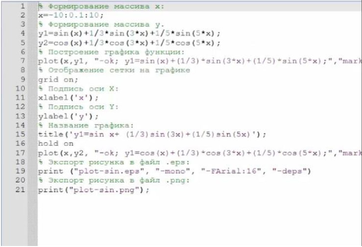{#fig:001 width=70%}

Запустим сценарий на выполнение. В качестве результата выполнения кода открылось окно с построенным графиком (рис. 2) и в рабочем
каталоге появились файлы с графиками в форматах .eps, .jpg. (рис. 3).

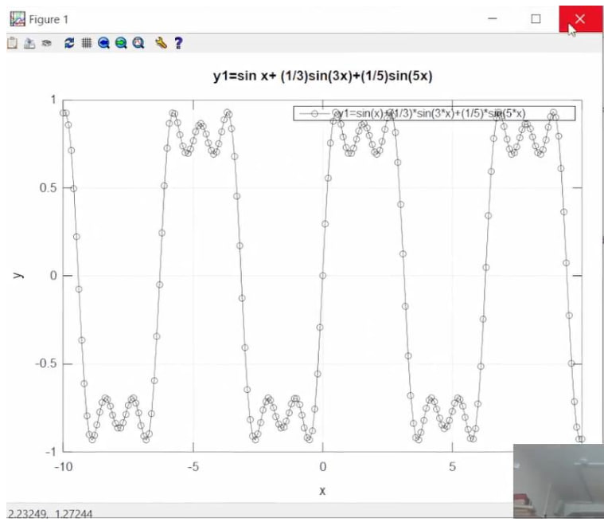{#fig:002 width=70%}

Сохраним сценарий под другим названием и изменим его так, чтобы на одном графике располагались отличающиеся по типу линий графики функций
y1 = sin(x) + 1/3 _ sin(3x) + 1/5 _ sin(5x), y2 = cos(x) + 1/3 _ cos(3x) + 1/5 _ cos(5x) (рис. 4)

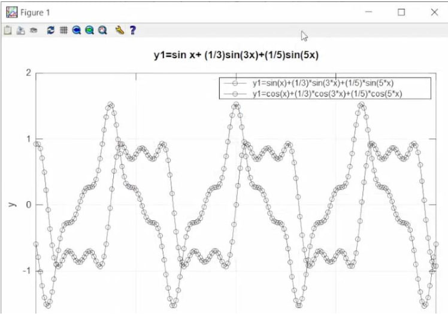{#fig:004 width=70%}

## Разложение импульсного сигнала в частичный ряд Фурье

Создадим новый сценарий и сохраним его в рабочий каталог с именем meandr.m. В коде повторим листинг по построению графиков меандра. (рис. 5)

{#fig:005 width=70%}

Экспортируем полученный график в файл в формате .jpg. (рис. 6)

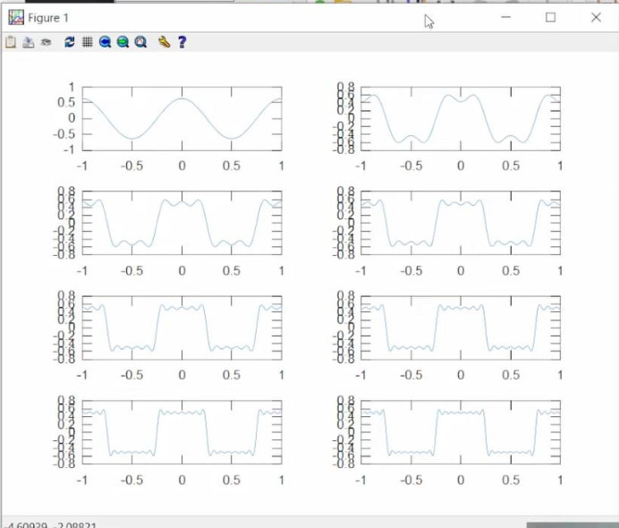{#fig:006 width=70%}

Скорректируем код для реализации меандра через синусы. Получим соответствующие графики. (рис. 7)

{#fig:007 width=70%}

## Определение спектра и параметров сигнала

В рабочем каталоге создадим каталог spectre1 и в нём новый сценарий с именем, spectre.m. В коде повторим листинг по построению сигналов разной частоты. Получим график. (рис. 8)

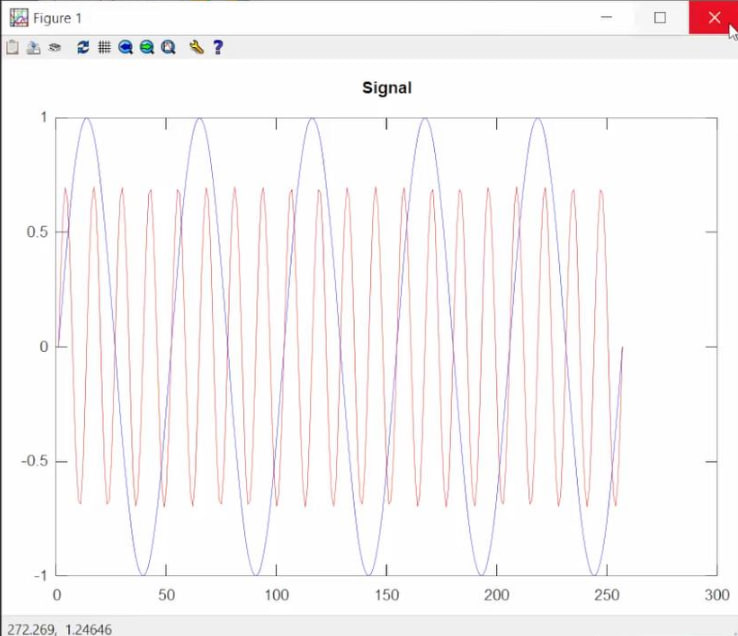{#fig:008 width=70%}

Далее добавим код для нахождения спектров сигналов с помощью быстрого преобразования Фурье и получим график. (рис. 9)

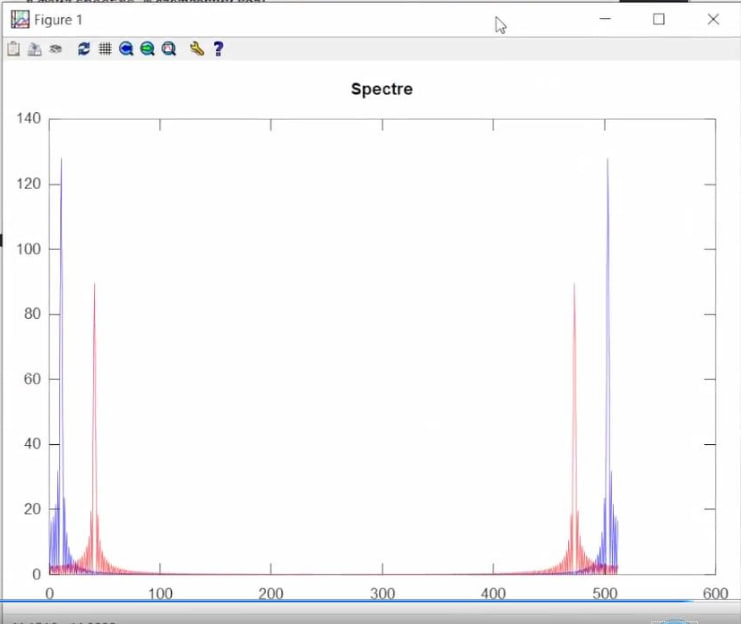{#fig:009 width=70%}

Скорректируем график спектра: отбросим дублирующие отрицательные частоты, а также примем в расчёт то, что на каждом шаге вычисления быстрого преобразования
Фурье происходит суммирование амплитуд сигналов. (рис. 10)

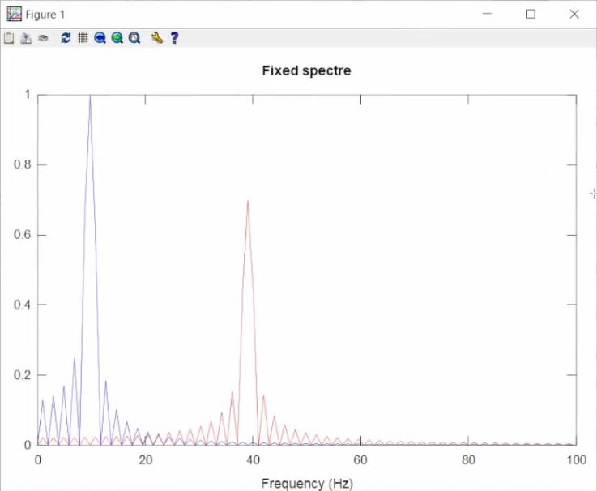{#fig:010 width=70%}

## Амплитудная модуляция

В рабочем каталоге создадим каталог modulation и в нём новый сценарий с именем am.m. Добавим в файле am.m код из листинга. (рис. 12)

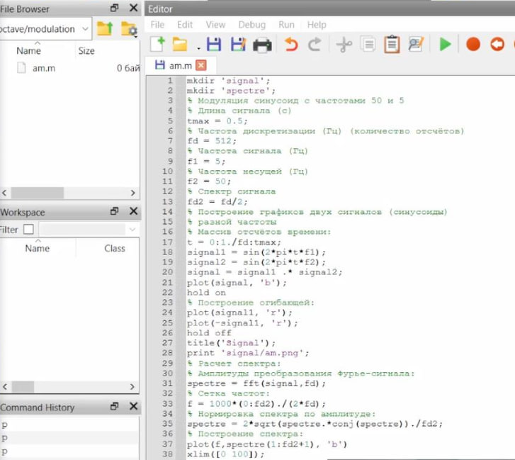{#fig:012 width=70%}

В результате получаем, что спектр произведения представляет собой свёртку спектров (рис. 13)

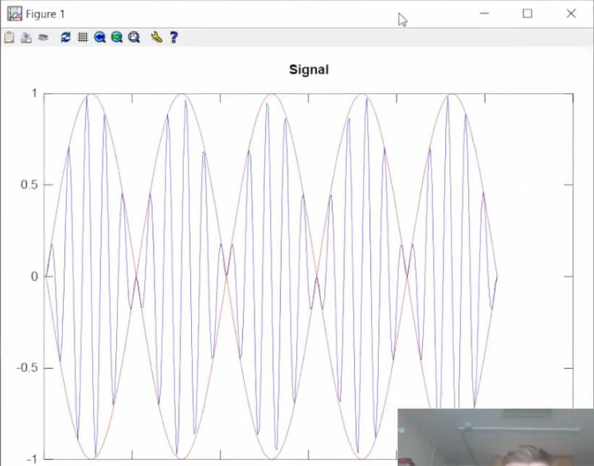{#fig:013 width=70%}

## Кодирование сигнала. Исследование свойства самосинхронизации сигнала

В рабочем каталоге создадим каталог coding и в нём файлы main.m, maptowave.m,unipolar.m,ami.m,bipolarnrz.m,bipolarrz.m,manchester.m,
diffmanc.m, calcspectre.m (рис. 14)

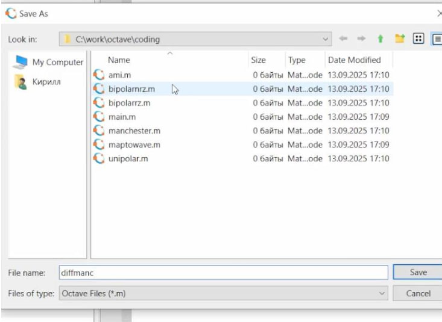{#fig:014 width=70%}

В окне интерпретатора команд проверим, установлен ли пакет расширений signal: >> pkg list. Видим, что он установлен. (рис. 15)

{#fig:015 width=70%}

В файле main.m подключим пакет signal и скопируем программу из листинга. (рис. 16)

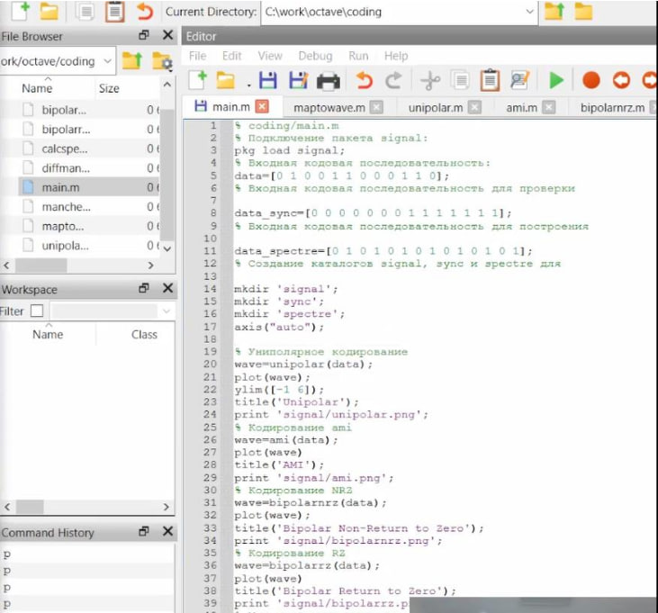{#fig:016 width=70%}

Запустим главный скрипт main.m. В каталоге signal получены
файлы с графиками кодированного сигнала, в каталоге sync — файлы с графиками, иллюстрирующими свойства самосинхронизации, в каталоге spectre — файлы с графиками спектров сигналов. (рис. 19)

{#fig:019 width=70%}

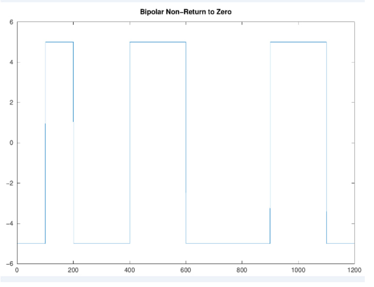{#fig:020 width=70%}

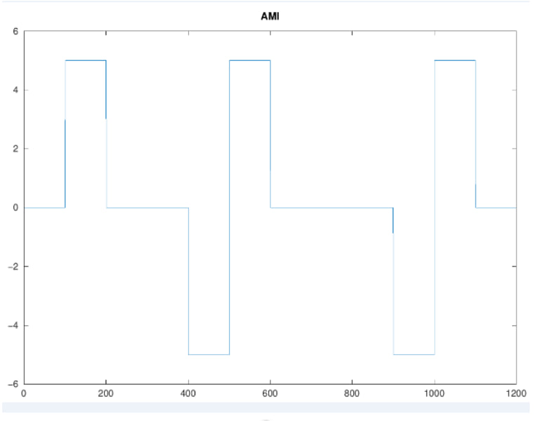{#fig:021 width=70%}

{#fig:022 width=70%}

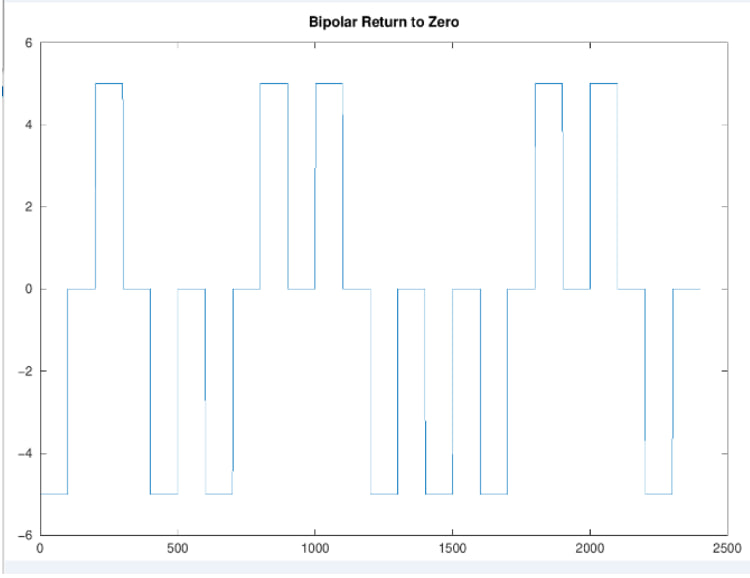{#fig:023 width=70%}

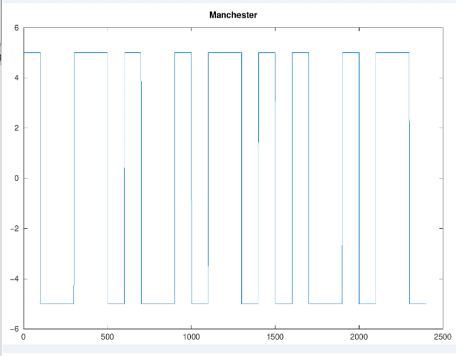{#fig:024 width=70%}

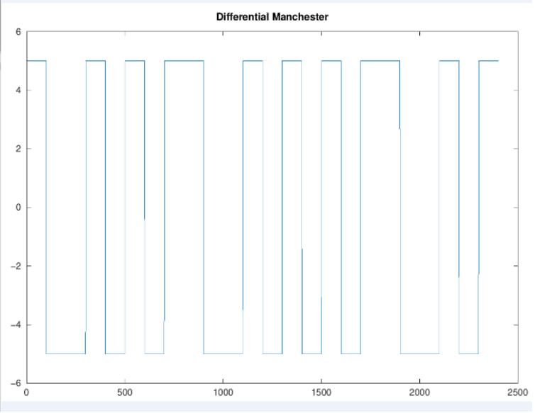{#fig:025 width=70%}

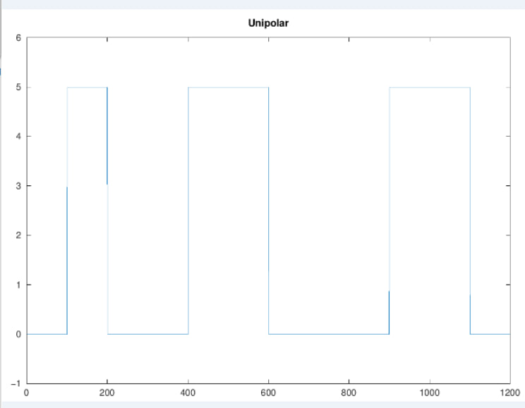{#fig:026 width=70%}

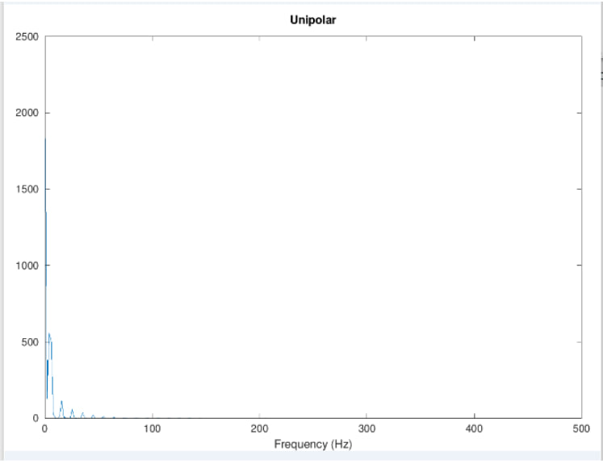{#fig:032 width=70%}

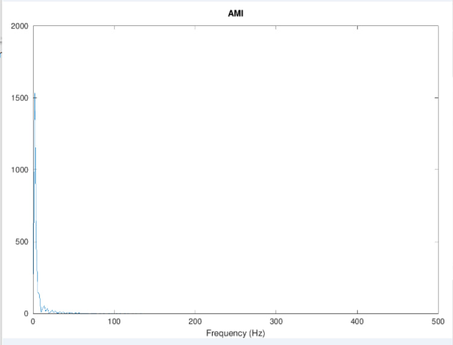{#fig:033 width=70%}

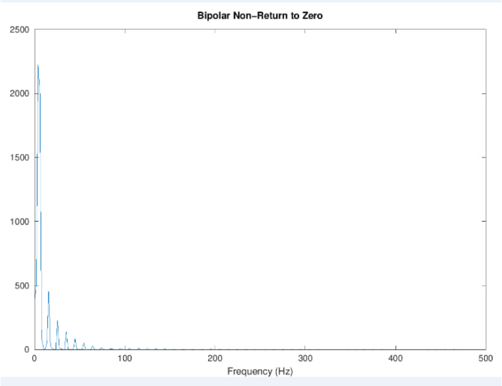{#fig:034 width=70%}

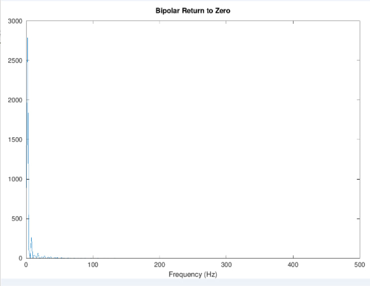{#fig:035 width=70%}

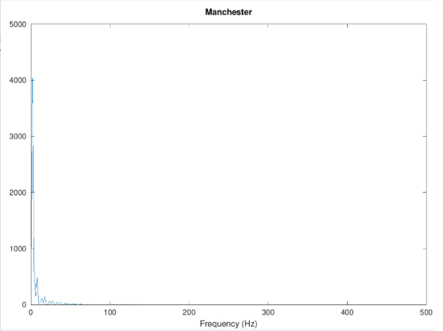{#fig:036 width=70%}

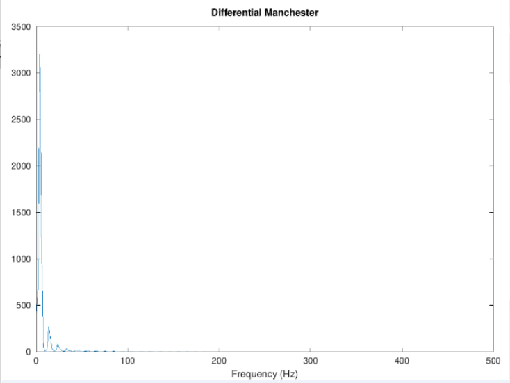{#fig:037 width=70%}

# Выводы

В рамках лабораторной работы мы изучили методов кодирования и модуляции сигналов с помощью высокоуровнего языка программирования Octave. Определили спектра и параметров
сигнала. Продемонстрировали принципы модуляции сигнала на примере аналоговой
амплитудной модуляции. Исследовали свойства самосинхронизации сигнала.
