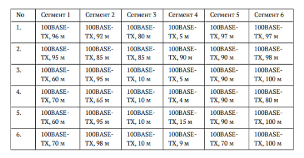

---
## Front matter
author: "Жаворонков Кирилл Александрович"

title: "Отчет по лабораторной работе №2"
subtitle: "Дисциплина: Сетевые технологии"
license: "CC BY"
---

# Цель работы

Цель данной работы — изучение принципов технологий Ethernet и Fast Ethernet
и практическое освоение методик оценки работоспособности сети, построенной
на базе технологии Fast Ethernet.

# Задание

Требуется оценить работоспособность 100-мегабитной сети Fast Ethernet в соответствии с первой и второй моделями.

# Выполнение лабораторной работы

Для оценки работоспособности сети в соответствии с первой моделью, необходимо взять самые удаленные пути между двумя узлами домена коллизий. Необходимо сложить их и сравнить с предельно допустимым диаметром домена коллизий в Fast Ethernet при наличии двух повторителей класса II. Это значение составляет 205.

Для оценки работоспособности сети в соответствии со второй моделью, выполняем аналогичные действия, только диаметр домена коллизий и количество сегментов в нём ограничены временем двойного оборота, необходимым для правильной работы механизма
обнаружения и разрешения коллизий для вычисления времени двойного оборота нужно умножить длину сегмента
на величину удельного времени двойного оборота соответствующего сегмента.
Определив времена двойного оборота для всех сегментов наихудшего пути,
к ним нужно прибавить задержку, вносимую парой оконечных узлов и повторителями. Для учёта непредвиденных задержек к полученному результату
рекомендуется добавить ещё 4 битовых интервала (би) и сравнить результат
с числом 512. Если полученный результат не превышает 512 би, то сеть считается
работоспособной.

Вариант 1:
Первая модель: 96+5+97=198 (198<205)
Вывод: удовлетворяет условию работоспособности сети по первой модели.
Вторя модель: 100+92+92+(96+5+97)*1,112=504 (504<512)
Вывод: удовлетворяет условию работоспособности сети по второй модели.
Вариант 2:
Первая модель: 95+90+98=283 (283>205)
Вывод: не удовлетворяет условию работоспособности сети по первой модели.
Вторя модель: 100+92+92+(95+90+98)*1,112=598 (598>512)
Вывод: не удовлетворяет условию работоспособности сети по второй модели.
Вариант 3:
Первая модель: 60+5+100=165 (165<205)
Вывод: удовлетворяет условию работоспособности сети по первой модели.
Вторя модель: 100+92+92+(60+5+100)*1,112=467 (467<512)
Вывод: удовлетворяет условию работоспособности сети по второй модели.
Вариант 4:
Первая модель: 70+4+80=154 (154<205)
Вывод: удовлетворяет условию работоспособности сети по первой модели.
Вторя модель: 100+92+92+(70+4+80)*1,112=455 (455<512)
Вывод: удовлетворяет условию работоспособности сети по второй модели
Вариант 5:
Первая модель: 60+15+100=175 (175<205)
Вывод: удовлетворяет условию работоспособности сети по первой модели.
Вторя модель: 100+92+92+(60+15+100)*1,112=478 (478<512)
Вывод: удовлетворяет условию работоспособности сети по второй модели.
Вариант 6:
Первая модель: 70+9+100=179 (179<205)
Вывод: удовлетворяет условию работоспособности сети по первой модели.
Вторя модель: 100+92+92+(70+9+100)*1,112=483 (483<512)
Вывод: удовлетворяет условию работоспособности сети по второй модели.

{#fig:001 width=70%}

# Выводы

В рамках лабораторной работы мы оценили работоспособность 100-мегабитной сети Fast Ethernet в соответствии с первой и второй моделями.
