---
## Front matter
author: "Жаворонков Кирилл Александрович"

title: "Отчет по лабораторной работе №4"
subtitle: "Дисциплина: Сетевые технологии"
license: "CC BY"
---

# Цель работы

Установка и настройка GNS3 и сопутствующего программного обеспечения.

# Задание

1. Установить GNS3-all-in-one, GNS3 VM, проверить корректность запуска (см.
   раздел 4.3).
2. Импортировать в GNS3 образ маршрутизатора FRR (см. раздел 4.4).
3. Импортировать в GNS3 образ маршрутизатора VyOS (см. раздел 4.4).

# Выполнение лабораторной работы

## Установка GNS3-all-in-one

Сначала я скачал с репозитория GitHub необходимый .exe файл. Далее запускаю его, следуя указаниям, нажимая
Next, принимая соглашение по лицензии, выбирая отображение названия
каталога в стартовом меню. (рис. 1)

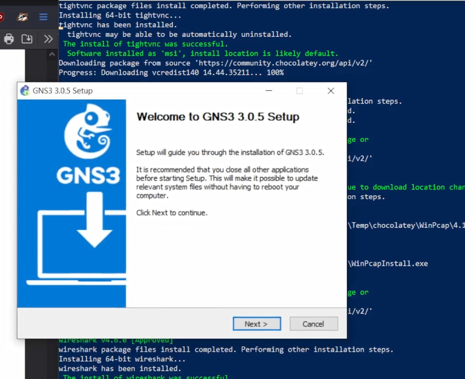{#fig:001 width=70%}

В процессе установки при выборе комплектации требуется отметить MSVC
Runtime (отмечено по умолчанию), GNS3-Desktop, GNS3-VM, Tools. (рис. 2)

{#fig:002 width=70%}

Затем требуется указать расположение устанавливаемого пакета (можно оставить
выдаваемое по умолчанию). В следующем окне требуется отметить тип
виртуальной машины (VirtualBox), затем нажать Inslall (рис. 3)

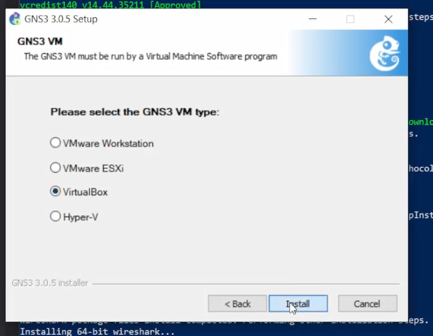{#fig:003 width=70%}

В конце процесса установки появится
окно с предложением запуска GNS3 после установки, снимаю галочку, нажимаю Finish. (рис. 5)

{#fig:005 width=70%}

## Установка GNS3 VM для VirtualBox

Перейдем в каталог, в который скачан архив с образом виртуальной машины
GNS3.VM.VirtualBox.номер-версии.zip. Распакуем архив с образом. (рис. 6)

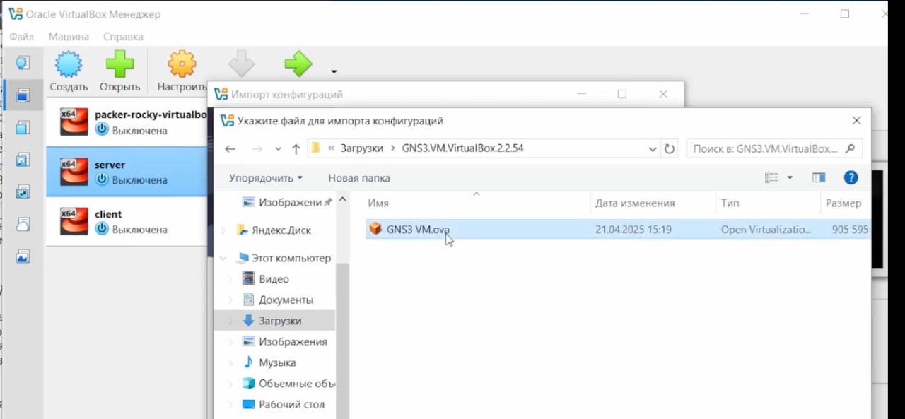{#fig:006 width=70%}

Запустим VirtualBox. Выберем меню Файл Импорт конфигураций... Укажем
месторасположение распакованного образа GNS3 VM.ova. В следующем окне
в параметрах импорта выберем в политике MAC-адреса «Сгенерировать
новые MAC-адреса всех сетевых адаптеров». Нажмем Импорт. (рис. 7)

{#fig:007 width=70%}

Уточним параметры настройки виртуальной машины GNS3 VM в VirtualBox. Основная память — не менее 2048 МБ, число процессоров — 2 ЦП. Далее нужно убедиться, что в VirtualBox в графическом интерфейсе флажок «Включить Nested VT-x/AMD-V» отмечен включённым (рис. 8)

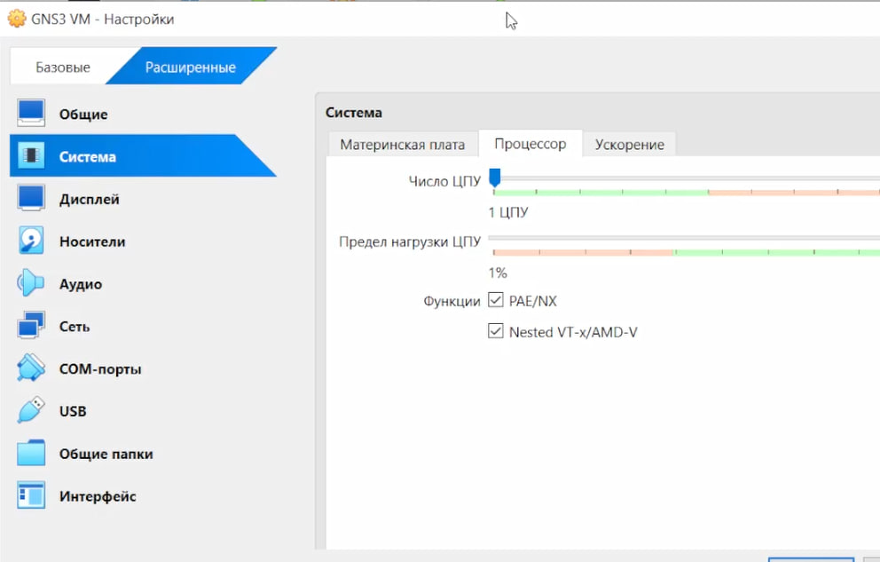{#fig:008 width=70%}

Настроим сетевой адаптер. Для этого в VirtualBox выберем импортированную виртуальную машину и перейдем в меню Машина Настроить. Перейдем
к опции «Сеть» и во вкладке «Адаптер 1» тип подключения должен быть
установлен как «Виртуальный адаптер хоста». (рис. 9)

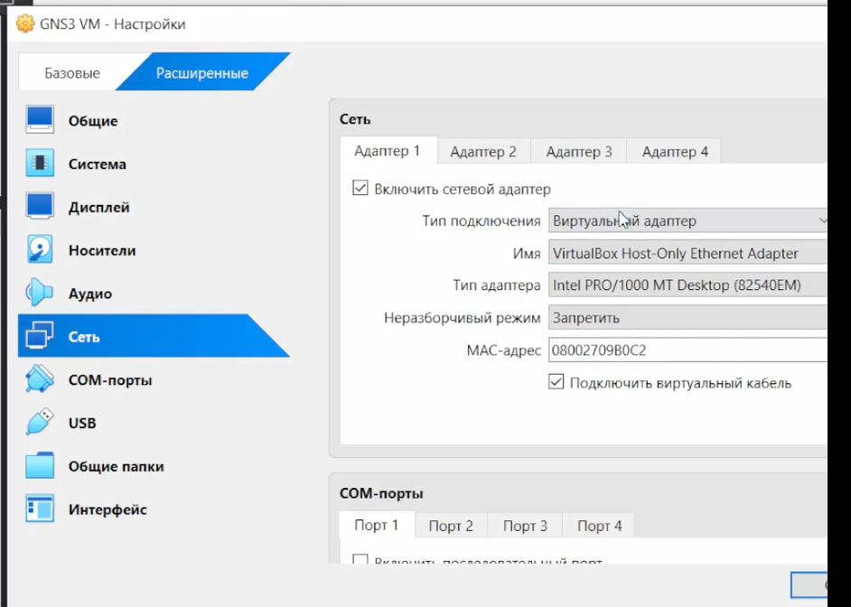{#fig:009 width=70%}

## Запуск экземпляра GNS3 в VirtualBox

Запустим GNS3 VM в VirtualBox. (рис. 10)

{#fig:010 width=70%}

Затем в основной операционной системе запустим приложение gns3. (рис. 11)

Интерфейс GNS3. (рис. 14)

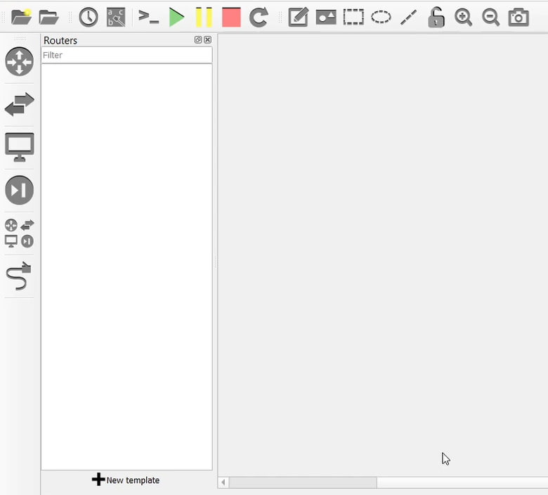{#fig:014 width=70%}

## Добавление образа маршрутизатора FRR

В рабочем пространстве GNS3 на левой боковой панели выберем просмотр
маршрутизаторов (Browse Routers), затем нажмем на + New template.
В открывшемся окне укажем рекомендуемое верхнее значение, а именно,
устанавливать образ с GNS3-сервера (рис. 15)

{#fig:015 width=70%}

В следующем окне выберем Routers и образ FRR (FRRouting), нажмем Install. (рис. 16)

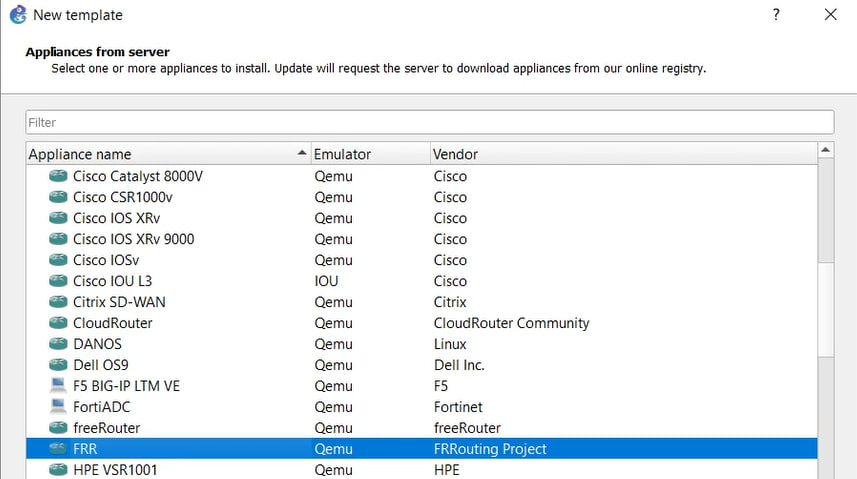{#fig:016 width=70%}

В следующем окне укажем, что устанавливать образ следует на виртуальную
машину GNS3 VM, нажмем Next. Далее предлагается выбор эмулятора, оставлю предложенное, нажмем Next. В следующем
окне предлагается перечень файлов для скачивания и последующей установки. Выберем наиболее актуальную версию и нажмем Download (рис. 17)

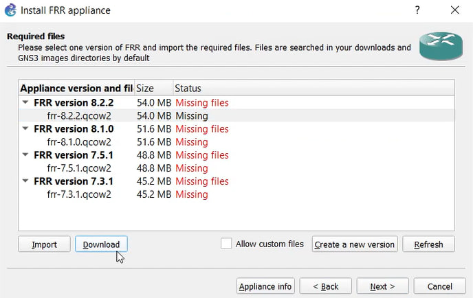{#fig:017 width=70%}

После окончания скачивания можно импортировать образ, затем нажать Next. (рис. 18)

{#fig:018 width=70%}

В рабочем пространстве на левой панели в списке маршрутизаторов появится
образ устройства FRR.
Далее необходимо настроить образ маршрутизатора. Правой кнопкой мыши
щёлкнем на образе устройства, в меню выберем Configure template. (рис. 20)

{#fig:020 width=70%}

В открывшемся окне необходимо во вкладке «General settings» в поле «On close» выбрать Send the shutdown signal (ACPI) . Во вкладке «HDD»
необходимо поставить галочку «Automatically create a config disk on HDD». (рис. 21, 22)

{#fig:021 width=70%}

{#fig:022 width=70%}

## Добавление образа маршрутизатора VyOS

По аналогии с установкой FRR, на левой боковой панели выберем просмотр
маршрутизаторов (Browse Routers), затем нажмем на + New template. В следующем окне выберем Routers и образ VyOS, нажмем Install (рис. 23)

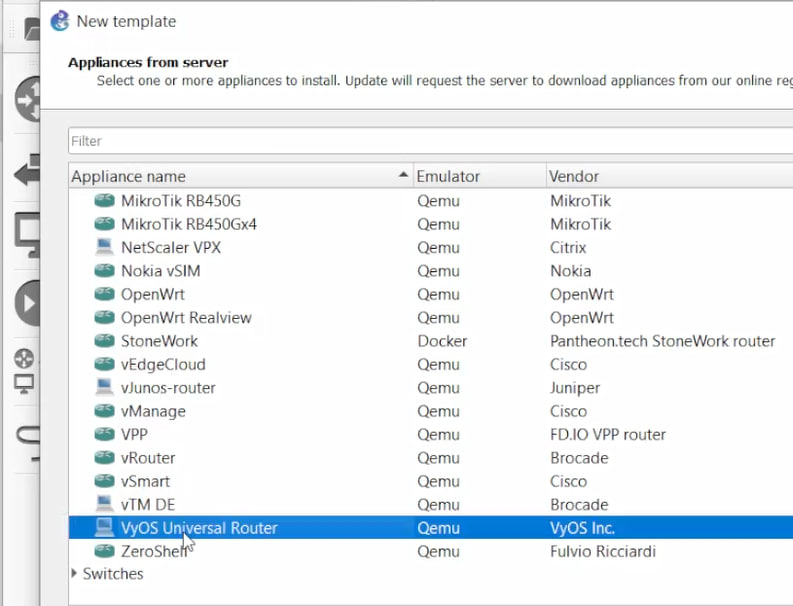{#fig:023 width=70%}

Выберем версию и нажмем Download. (рис. 24)

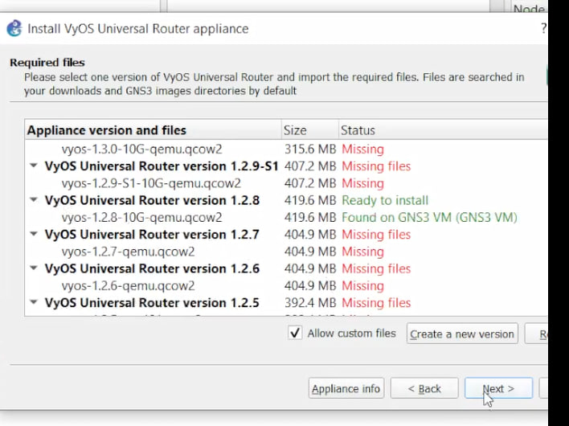{#fig:024 width=70%}

После окончания скачивания можно импортировать образ, затем нажать Next. (рис. 25)

{#fig:025 width=70%}

В рабочем пространстве на левой панели в списке маршрутизаторов появится
образ VyOS.
Далее необходимо настроить образ маршрутизатора. Правой кнопкой мыши
щёлкнем на образе устройства, в меню выберем Configure template. В открывшемся окне необходимо во вкладке «General settings» в поле «On close» выбрать Send the shutdown signal (ACPI). Во вкладке «HDD»
необходимо поставить галочку «Automatically create a config disk on HDD». (рис. 26, 27)

{#fig:026 width=70%}

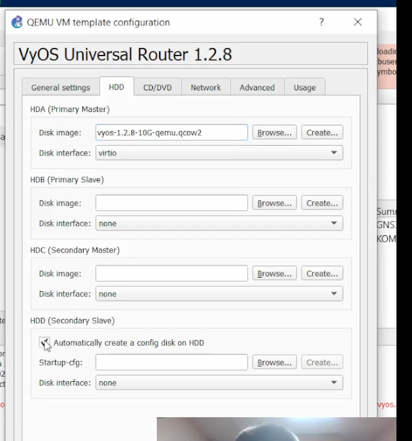{#fig:027 width=70%}

# Выводы

В ходе выполнения лабораторной работы мы установили и настроили GNS3 и сопутствующее программное обеспечение.
