---
# Preamble

## Author
author:
  name: Жаворонков Кирилл Александрович
## Title
title: Отчет по лабораторной работе № 5
subtitle: Сетевые технологии
license: CC BY
date: 2025-09-05

## Generic options
lang: ru-RU
crossref:
  lof-title: Список иллюстраций
  lot-title: Список таблиц
  lol-title: Листинги

## Fonts
mainfont: PT Serif
romanfont: PT Serif
sansfont: PT Sans
monofont: PT Mono
mainfontoptions: Ligatures=TeX
romanfontoptions: Ligatures=TeX
sansfontoptions: Ligatures=TeX,Scale=MatchLowercase
monofontoptions: Scale=MatchLowercase,Scale=0.9

## Formats
format:
  ### Pdf output format
  beamer:
    toc: true
    toc-title: Содержание
    number-sections: true
    colorlinks: false
    toc-depth: 2
    slide_level: 2
    aspectratio: 169
    section-titles: true
    theme: metropolis
    themeoptions: progressbar=frametitle,sectionpage=progressbar,numbering=fraction
    pdf-engine: xelatex
    fontenc: T2A
    #### Language
    babel-lang: russian
    babel-otherlangs: english

  ### Html output
  revealjs:
    transition: slide
    margin: 0.2
    smaller: false
    output-ext: html
    theme: beige
    logo: _resources/image/logo_rudn.png
---

## Цель

Построение простейших моделей сети на базе коммутатора и маршрутизаторов FRR и VyOS в GNS3, анализ трафика посредством Wireshark.

## Моделирование простейшей сети на базе коммутатора в GNS3

Создадим новый проект. (рис. 2)

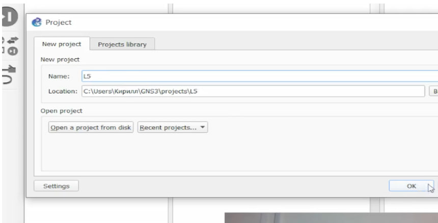{#fig:002 width=70%}

## Моделирование простейшей сети на базе коммутатора в GNS3

В рабочей области разместим коммутатор Ethernet и два VPCS. Изменим
название устройств. (рис. 3)

{#fig:003 width=70%}

## Моделирование простейшей сети на базе коммутатора в GNS3

Зададим IP-адреса VPCS. (рис. 4)

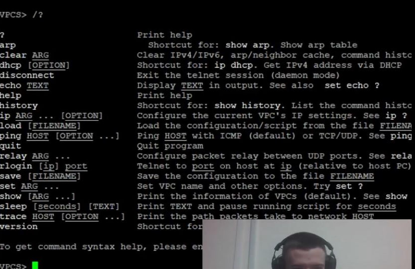{#fig:004 width=70%}

## Моделирование простейшей сети на базе коммутатора в GNS3

Зададим IP-адрес 192.168.1.11 для PC-1.

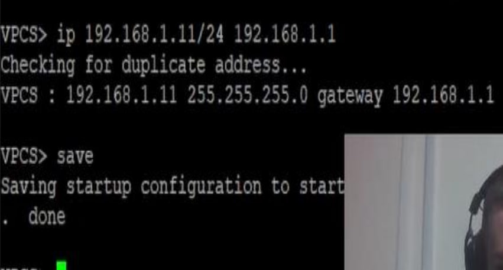{#fig:005 width=70%}

## Моделирование простейшей сети на базе коммутатора в GNS3

Аналогичным образом зададим IP-адрес 192.168.1.12 для PC-2. (рис. 6)

{#fig:006 width=70%}

## Моделирование простейшей сети на базе коммутатора в GNS3

Проверим работоспособность соединения между PC-1 и PC-2 (рис. 7)

{#fig:007 width=70%}

## Анализ трафика в GNS3 посредством Wireshark

Запустим на соединении между PC-1 и коммутатором анализатор трафика. (рис. 8)

{#fig:008 width=70%}

## Анализ трафика в GNS3 посредством Wireshark

В проекте GNS3 стартуем все узлы. В окне Wireshark отобразится информация по протоколу ARP. (рис. 9)

## Анализ трафика в GNS3 посредством Wireshark

{#fig:009 width=70%}

## Анализ трафика в GNS3 посредством Wireshark

В терминале PC-2 посмотрим информацию по опциям команды ping (рис. 10)

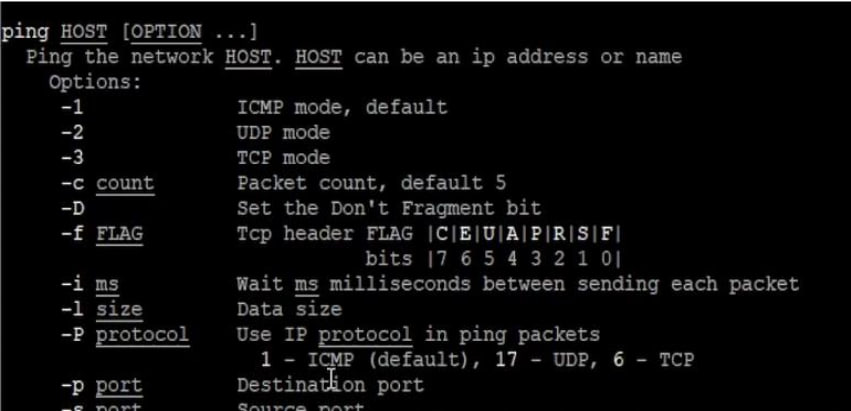{#fig:010 width=70%}

## Анализ трафика в GNS3 посредством Wireshark

Сделаем один эхо-запрос в ICMP-моде к узлу PC-1. (рис. 11)

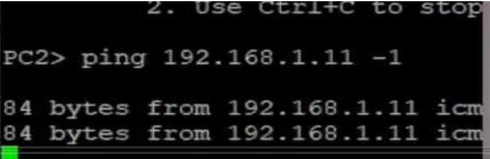{#fig:011 width=70%}

## Анализ трафика в GNS3 посредством Wireshark

{#fig:012 width=70%}

## Анализ трафика в GNS3 посредством Wireshark

Сделаем один эхо-запрос в UDP-моде к узлу PC-1. (рис. 13)

{#fig:013 width=70%}

## Анализ трафика в GNS3 посредством Wireshark

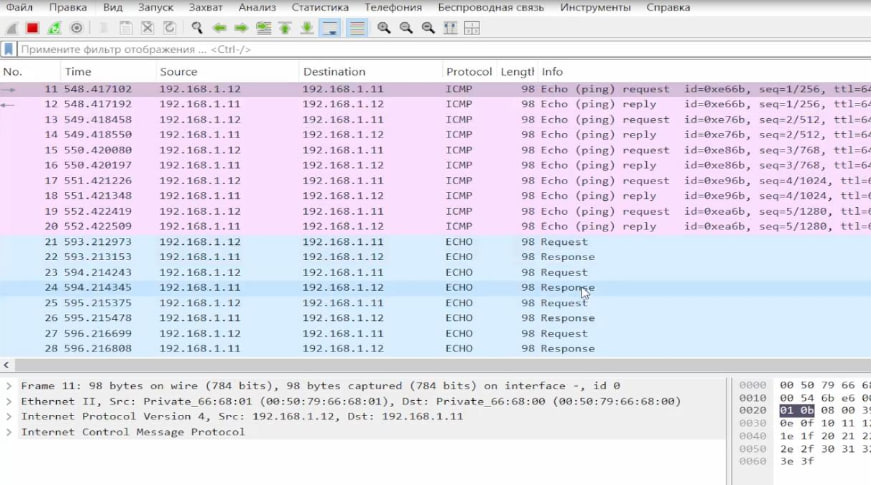{#fig:014 width=70%}

## Анализ трафика в GNS3 посредством Wireshark

Сделаем один эхо-запрос в TCP-моде к узлу PC-1. (рис. 15)

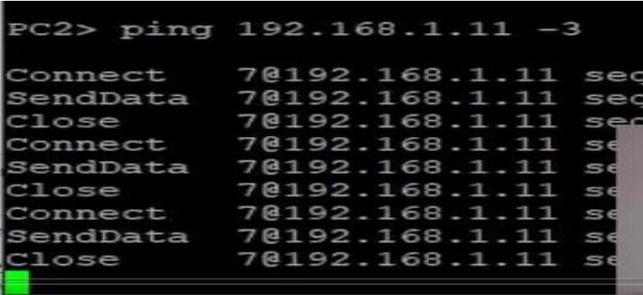{#fig:015 width=70%}

## Анализ трафика в GNS3 посредством Wireshark

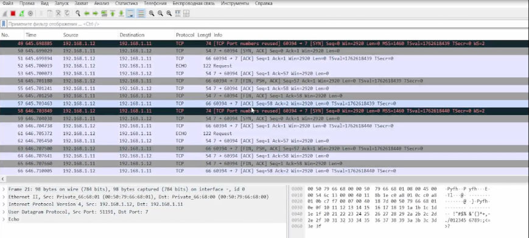{#fig:016 width=70%}

## Моделирование простейшей сети на базе маршрутизатора FRR в GNS3

Создадим новый проект. В рабочей области разместим VPCS, коммутатор Ethernet и маршрутизатор FRR. (рис. 17)

{#fig:017 width=70%}

## Моделирование простейшей сети на базе маршрутизатора FRR в GNS3

Включим захват трафика на соединении между коммутатором и маршрутизатором. (рис. 18)

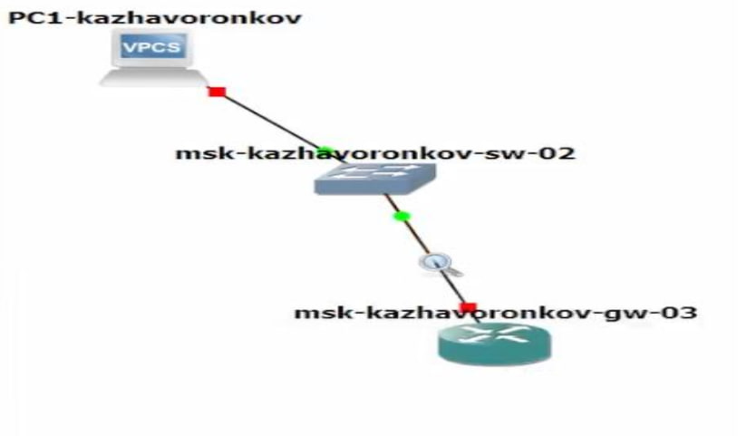{#fig:018 width=70%}

## Моделирование простейшей сети на базе маршрутизатора FRR в GNS3

Настроим IP-адресацию для интерфейса узла PC1: (рис. 19)

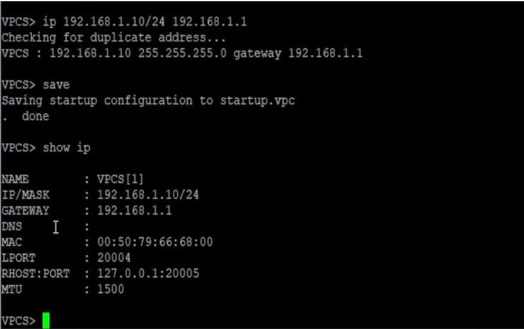{#fig:019 width=70%}

## Моделирование простейшей сети на базе маршрутизатора FRR в GNS3

Настроим IP-адресацию для интерфейса локальной сети маршрутизатора: (рис. 20)

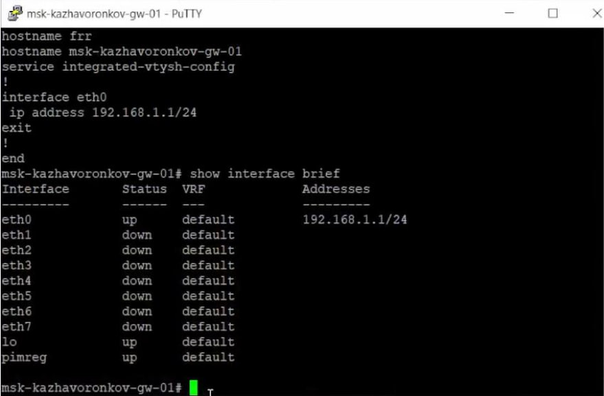{#fig:020 width=70%}

## Моделирование простейшей сети на базе маршрутизатора FRR в GNS3

Проверим конфигурацию маршрутизатора и настройки IP-адресации: (рис. 21)

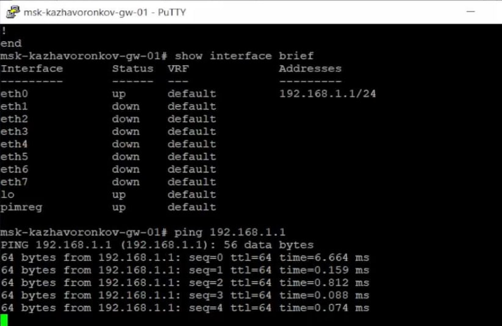{#fig:021 width=70%}

## Моделирование простейшей сети на базе маршрутизатора FRR в GNS3

Проверим подключение. (рис. 22)

{#fig:022 width=70%}

## Моделирование простейшей сети на базе маршрутизатора FRR в GNS3

{#fig:023 width=70%}

## Моделирование простейшей сети на базе маршрутизатора VyOS в GNS3

Создадим новый проект. В рабочей области GNS3 разместим VPCS, коммутатор Ethernet и маршрутизатор VyOS. (рис. 24)

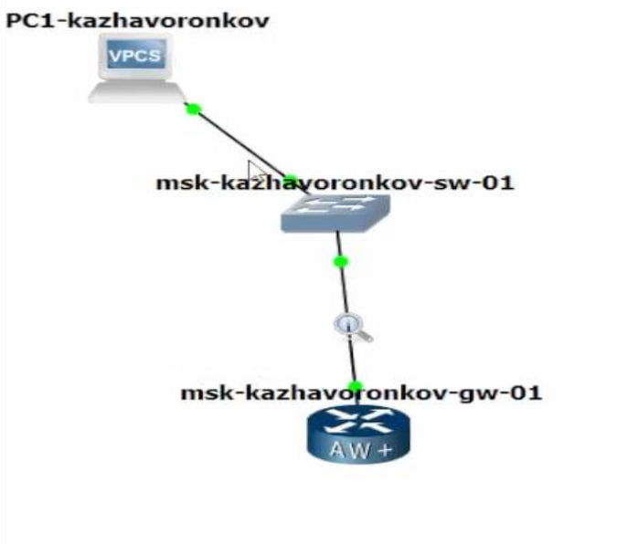{#fig:024 width=70%}

## Моделирование простейшей сети на базе маршрутизатора VyOS в GNS3

Включим захват трафика на соединении между коммутатором и маршрутизатором. (рис. 25)

{#fig:025 width=70%}

## Моделирование простейшей сети на базе маршрутизатора VyOS в GNS3

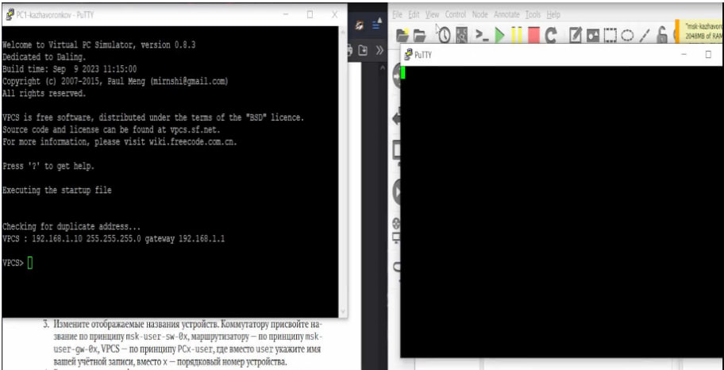{#fig:026 width=70%}

## Моделирование простейшей сети на базе маршрутизатора VyOS в GNS3

Настроим маршрутизатор VyOS. (рис. 27)

{#fig:027 width=70%}

## Моделирование простейшей сети на базе маршрутизатора VyOS в GNS3

Установим систему на диск (рис. 28)

{#fig:028 width=70%}

## Моделирование простейшей сети на базе маршрутизатора VyOS в GNS3

Изменим имя устройства (рис. 29)

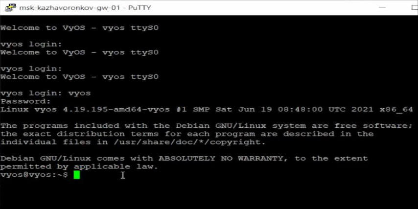{#fig:029 width=70%}

## Моделирование простейшей сети на базе маршрутизатора VyOS в GNS3

Зададим IP-адрес на интерфейсе eth0. Посмотрим внесённые в конфигурацию изменения (рис. 30)

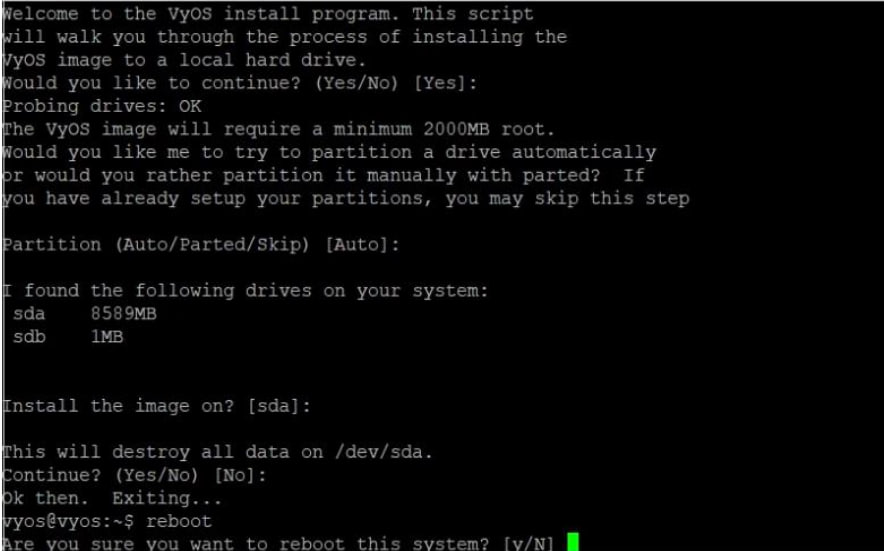{#fig:030 width=70%}

## Моделирование простейшей сети на базе маршрутизатора VyOS в GNS3

Применим изменения в конфигурации и сохраним саму конфигурацию: (рис. 31)

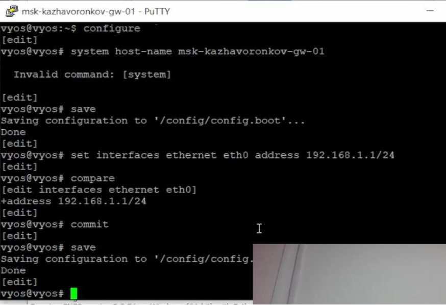{#fig:031 width=70%}

## Моделирование простейшей сети на базе маршрутизатора VyOS в GNS3

Посмотрим информацию об интерфейсах маршрутизатора (рис. 32)

{#fig:032 width=70%}

## Моделирование простейшей сети на базе маршрутизатора VyOS в GNS3

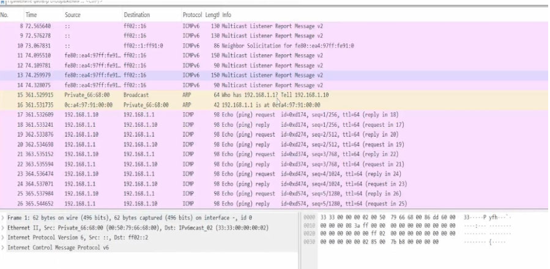{#fig:034 width=70%}

# Вывод

## Вывод

В ходе выполнения лабораторной работы мы построили простейшие модели сети на базе коммутатора и маршрутизаторов FRR и VyOS в GNS3, и проанализировали трафик посредством Wireshark.
