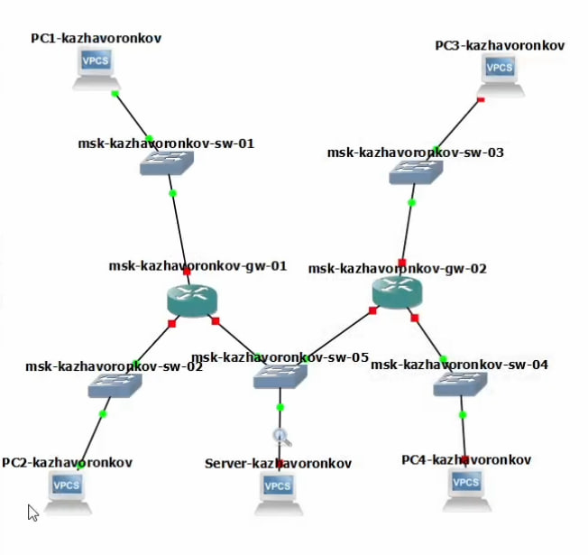
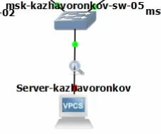
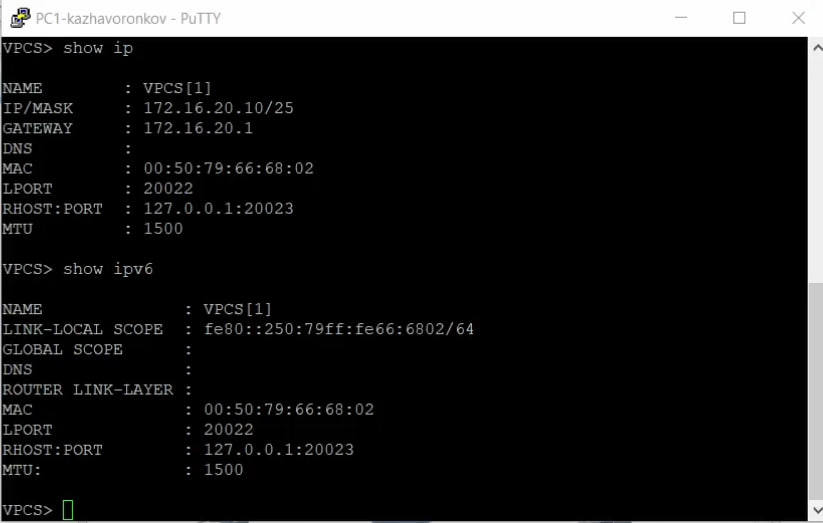
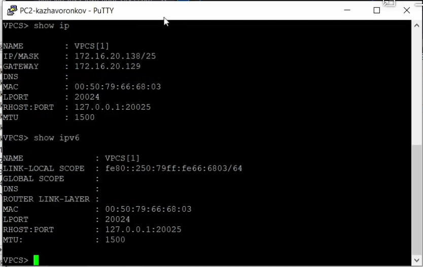
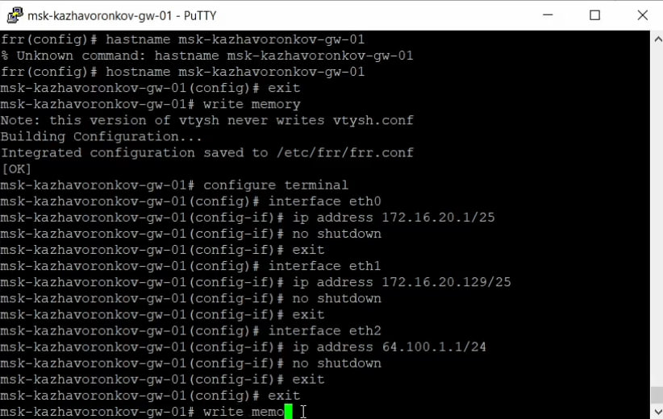
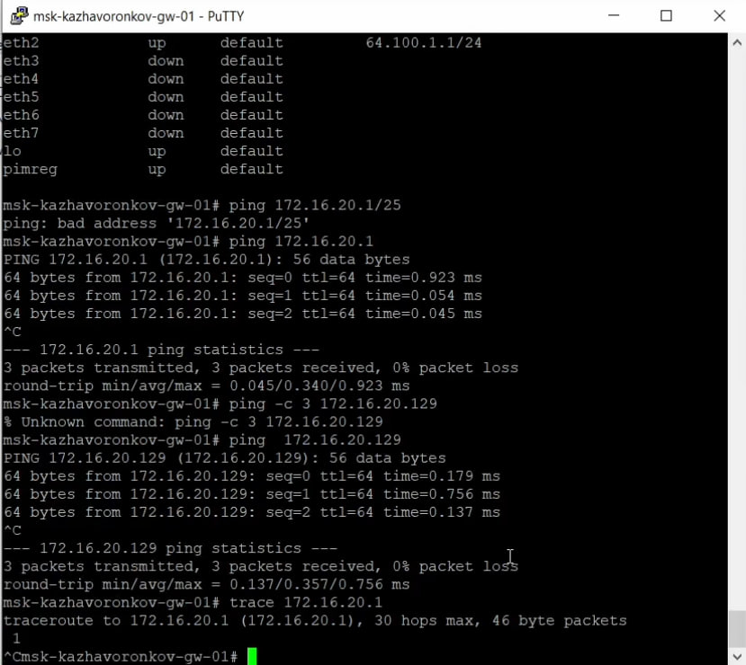
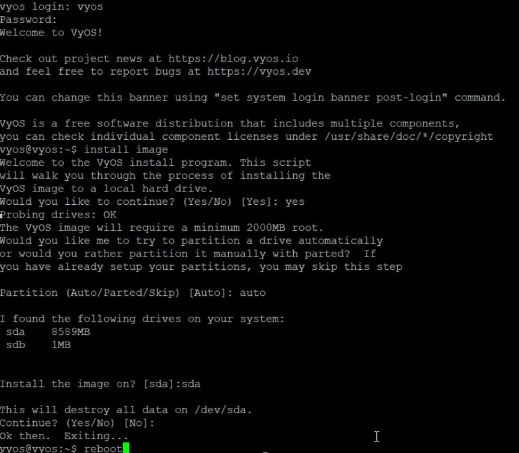
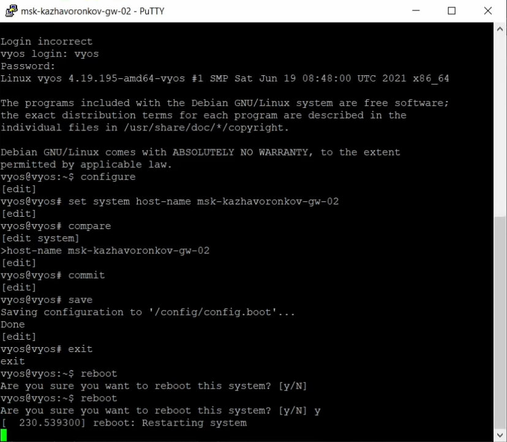

---
# Preamble

## Author
author:
  name: Жаворонков Кирилл Александрович
## Title
title: Отчет по лабораторной работе № 6
subtitle: Сетевые технологии
license: CC BY
date: 2025-09-05

## Generic options
lang: ru-RU
crossref:
  lof-title: Список иллюстраций
  lot-title: Список таблиц
  lol-title: Листинги

## Fonts
mainfont: PT Serif
romanfont: PT Serif
sansfont: PT Sans
monofont: PT Mono
mainfontoptions: Ligatures=TeX
romanfontoptions: Ligatures=TeX
sansfontoptions: Ligatures=TeX,Scale=MatchLowercase
monofontoptions: Scale=MatchLowercase,Scale=0.9

## Formats
format:
  ### Pdf output format
  beamer:
    toc: true
    toc-title: Содержание
    number-sections: true
    colorlinks: false
    toc-depth: 2
    slide_level: 2
    aspectratio: 169
    section-titles: true
    theme: metropolis
    themeoptions: progressbar=frametitle,sectionpage=progressbar,numbering=fraction
    pdf-engine: xelatex
    fontenc: T2A
    #### Language
    babel-lang: russian
    babel-otherlangs: english

  ### Html output
  revealjs:
    transition: slide
    margin: 0.2
    smaller: false
    output-ext: html
    theme: beige
    logo: _resources/image/logo_rudn.png
---

## Цель

Изучение принципов распределения и настройки адресного пространства на устройствах сети.

## Настройка двойного стека адресации IPv4 и IPv6 в локальной сети

{#fig:007 width=70%}

## Настройка двойного стека адресации IPv4 и IPv6 в локальной сети

Включим захват трафика.

{#fig:008 width=70%}

## Настройка двойного стека адресации IPv4 и IPv6 в локальной сети

Настроим IPv4-адресацию для интерфейсов узлов PC1, PC2, Server:

{#fig:009 width=70%}

## Настройка двойного стека адресации IPv4 и IPv6 в локальной сети

PC2:

{#fig:010 width=70%}

## Настройка двойного стека адресации IPv4 и IPv6 в локальной сети

Server:

{#fig:011 width=70%}

## Настройка двойного стека адресации IPv4 и IPv6 в локальной сети

{#fig:012 width=70%}

## Настройка двойного стека адресации IPv4 и IPv6 в локальной сети

{#fig:013 width=70%}

## Настройка двойного стека адресации IPv4 и IPv6 в локальной сети

{#fig:014 width=70%}

## Настройка двойного стека адресации IPv4 и IPv6 в локальной сети

{#fig:015 width=70%}

## Настройка двойного стека адресации IPv4 и IPv6 в локальной сети

{#fig:016 width=70%}

## Настройка двойного стека адресации IPv4 и IPv6 в локальной сети

{#fig:017 width=70%}

## Настройка двойного стека адресации IPv4 и IPv6 в локальной сети

Настроим IPv6-адресацию для интерфейсов узлов PC3, PC4, Server

{#fig:018 width=70%}

## Настройка двойного стека адресации IPv4 и IPv6 в локальной сети

PC4:

{#fig:019 width=70%}

## Настройка двойного стека адресации IPv4 и IPv6 в локальной сети

Server:

{#fig:020 width=70%}

## Настройка двойного стека адресации IPv4 и IPv6 в локальной сети

{#fig:021 width=70%}

## Настройка двойного стека адресации IPv4 и IPv6 в локальной сети

{#fig:022 width=70%}

## Настройка двойного стека адресации IPv4 и IPv6 в локальной сети

{#fig:023 width=70%}

## Настройка двойного стека адресации IPv4 и IPv6 в локальной сети

{#fig:024 width=70%}

## Настройка двойного стека адресации IPv4 и IPv6 в локальной сети

{#fig:025 width=70%}

## Настройка двойного стека адресации IPv4 и IPv6 в локальной сети

{#fig:026 width=70%}

## Настройка двойного стека адресации IPv4 и IPv6 в локальной сети

{#fig:027 width=70%}

# Вывод

## Вывод

В ходе выполнения лабораторной работы мы изучили принципы распределения и настройки адресного пространства на устройствах сети.
