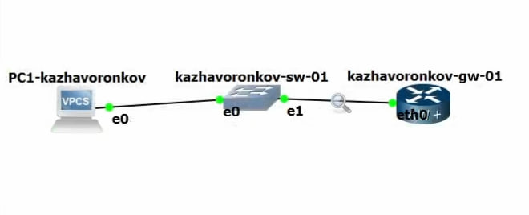
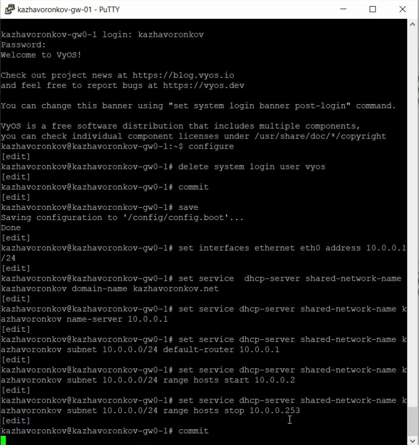
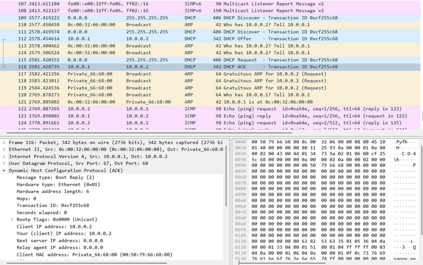
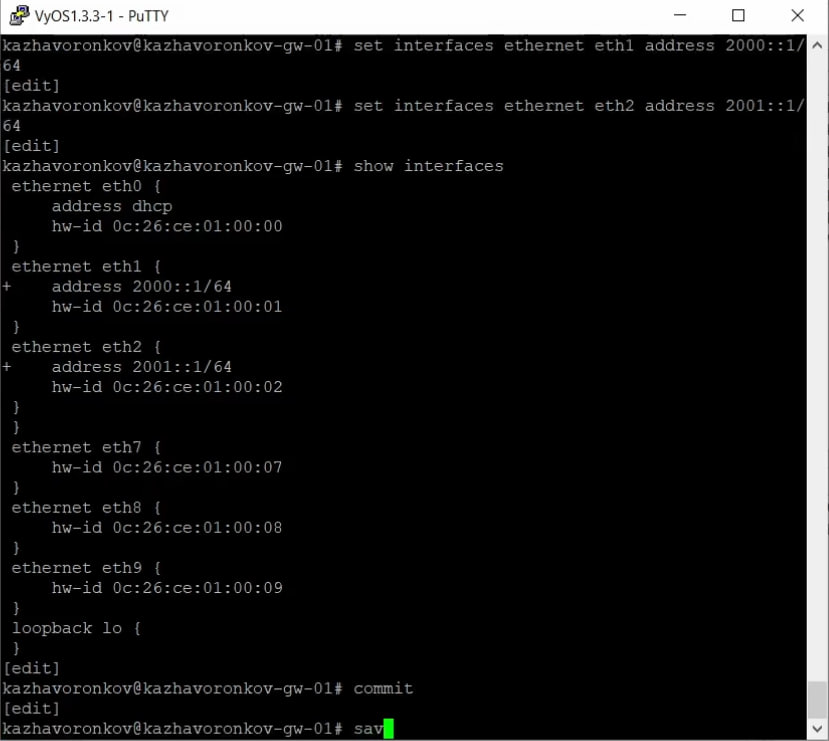
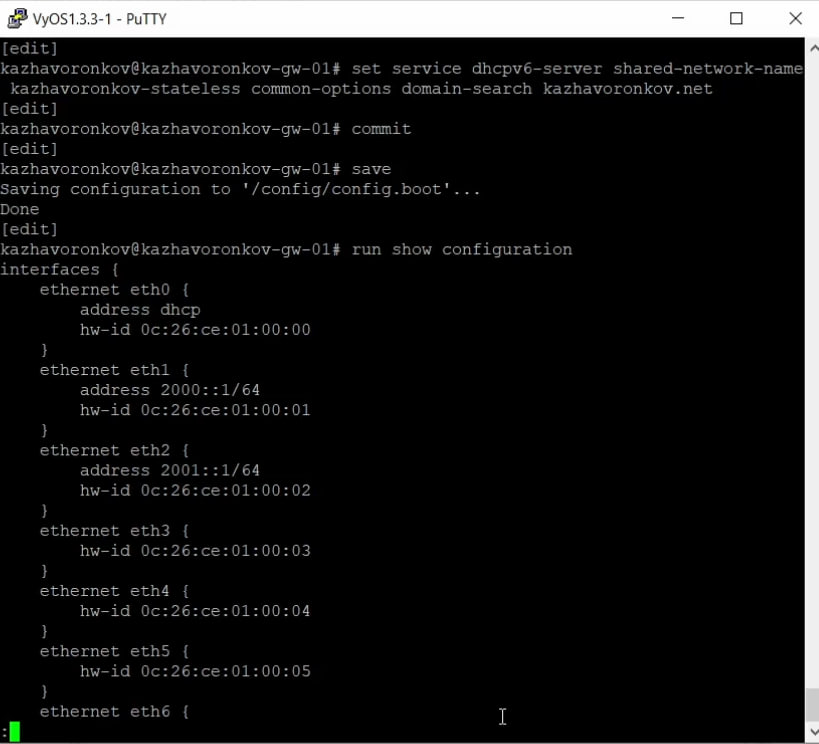
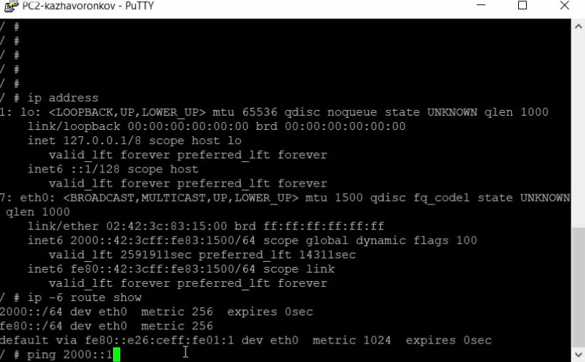
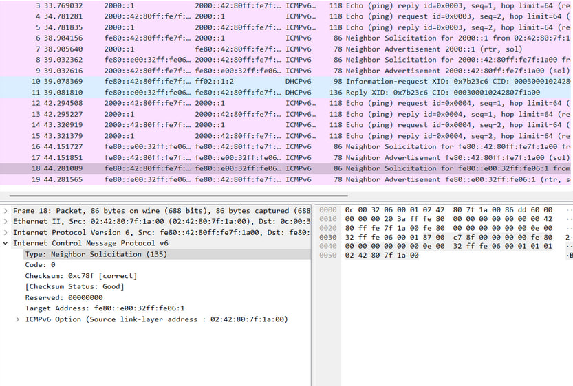
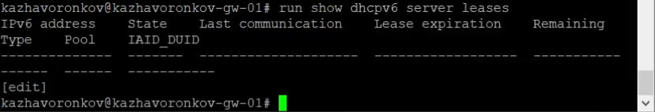
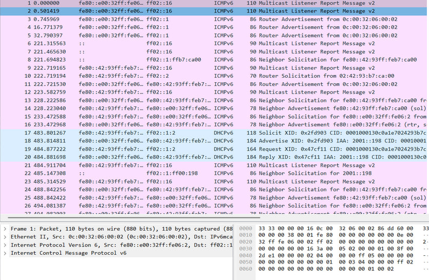

---
# Preamble

## Author
author:
  name: Жаворонков Кирилл Александрович
## Title
title: Отчет по лабораторной работе № 7
subtitle: Сетевые технологии
license: CC BY
date: 2025-09-05

## Generic options
lang: ru-RU
crossref:
  lof-title: Список иллюстраций
  lot-title: Список таблиц
  lol-title: Листинги

## Fonts
mainfont: PT Serif
romanfont: PT Serif
sansfont: PT Sans
monofont: PT Mono
mainfontoptions: Ligatures=TeX
romanfontoptions: Ligatures=TeX
sansfontoptions: Ligatures=TeX,Scale=MatchLowercase
monofontoptions: Scale=MatchLowercase,Scale=0.9

## Formats
format:
  ### Pdf output format
  beamer:
    toc: true
    toc-title: Содержание
    number-sections: true
    colorlinks: false
    toc-depth: 2
    slide_level: 2
    aspectratio: 169
    section-titles: true
    theme: metropolis
    themeoptions: progressbar=frametitle,sectionpage=progressbar,numbering=fraction
    pdf-engine: xelatex
    fontenc: T2A
    #### Language
    babel-lang: russian
    babel-otherlangs: english

  ### Html output
  revealjs:
    transition: slide
    margin: 0.2
    smaller: false
    output-ext: html
    theme: beige
    logo: _resources/image/logo_rudn.png
---

## Цель

Получение навыков настройки службы DHCP на сетевом оборудовании для
распределения адресов IPv4 и IPv6.

## Настройка DHCP в случае IPv4

{#fig:001 width=70%}

## Настройка DHCP в случае IPv4

{#fig:002 width=70%}

## Настройка DHCP в случае IPv4

На маршрутизаторе изменим имя устройства и доменное имя, заменим системного пользователя.

{#fig:003 width=70%}

## Настройка DHCP в случае IPv4

{#fig:004 width=70%}

## Настройка DHCP в случае IPv4

Настроим адресацию IPv4:

{#fig:005 width=70%}

## Настройка DHCP в случае IPv4

Добавим конфигурацию DHCP-сервера на маршрутизаторе:

{#fig:006 width=70%}

## Настройка DHCP в случае IPv4

{#fig:007 width=70%}

## Настройка DHCP в случае IPv4

{#fig:008 width=70%}

## Настройка DHCP в случае IPv4

{#fig:009 width=70%}

## Настройка DHCP в случае IPv4

{#fig:013 width=70%}

## Настройка DHCP в случае IPv6

{#fig:014 width=70%}

## Настройка DHCP в случае IPv6

{#fig:015 width=70%}

## Настройка DHCP в случае IPv6

На маршрутизаторе настроим DHCPv6 без отслеживания состояния:

{#fig:016 width=70%}

## Настройка DHCP в случае IPv6

Добавление конфигурации DHCP-сервера:

{#fig:017 width=70%}

## Настройка DHCP в случае IPv6

{#fig:018 width=70%}

## Настройка DHCP в случае IPv6

{#fig:019 width=70%}

## Настройка DHCP в случае IPv6

{#fig:020 width=70%}

## Настройка DHCP в случае IPv6

На узле PC2 получим адрес по DHCPv6 (запрос только информации DHCPv6, но не адреса)

{#fig:021 width=70%}

## Настройка DHCP в случае IPv6

Пропингуем от PC2 маршрутизатор

{#fig:022 width=70%}

## Настройка DHCP в случае IPv6

Проверим настройки DNS

{#fig:023 width=70%}

## Настройка DHCP в случае IPv6

{#fig:024 width=70%}

## Настройка DHCP в случае IPv6

{#fig:025 width=70%}

## Настройка DHCP в случае IPv6

На маршрутизаторе настроим DHCPv6 с отслеживанием состояния

{#fig:026 width=70%}

## Настройка DHCP в случае IPv6

Добавим конфигурацию DHCP-сервера на маршрутизаторе:

{#fig:027 width=70%}

## Настройка DHCP в случае IPv6

На маршрутизаторе посмотрим выданные адреса:

{#fig:028 width=70%}

## Настройка DHCP в случае IPv6

{#fig:029 width=70%}

## Настройка DHCP в случае IPv6

На узле PC3 проверим настройки DNS:

{#fig:030 width=70%}

## Настройка DHCP в случае IPv6

На узле PC3 получим адрес по DHCPv6:

{#fig:031 width=70%}

## Настройка DHCP в случае IPv6

{#fig:032 width=70%}

## Настройка DHCP в случае IPv6

{#fig:033 width=70%}

## Настройка DHCP в случае IPv6

{#fig:034 width=70%}

## Настройка DHCP в случае IPv6

{#fig:035 width=70%}

# Вывод

## Вывод

В ходе выполнения лабораторной работы мы получили навыки настройки службы DHCP на сетевом оборудовании для
распределения адресов IPv4 и IPv6.
