---
# Preamble

## Author
author:
  name: Жаворонков Кирилл Александрович
## Title
title: Отчет по лабораторной работе № 8
subtitle: Сетевые технологии
license: CC BY
date: 2025-09-05

## Generic options
lang: ru-RU
crossref:
  lof-title: Список иллюстраций
  lot-title: Список таблиц
  lol-title: Листинги

## Fonts
mainfont: PT Serif
romanfont: PT Serif
sansfont: PT Sans
monofont: PT Mono
mainfontoptions: Ligatures=TeX
romanfontoptions: Ligatures=TeX
sansfontoptions: Ligatures=TeX,Scale=MatchLowercase
monofontoptions: Scale=MatchLowercase,Scale=0.9

## Formats
format:
  ### Pdf output format
  beamer:
    toc: true
    toc-title: Содержание
    number-sections: true
    colorlinks: false
    toc-depth: 2
    slide_level: 2
    aspectratio: 169
    section-titles: true
    theme: metropolis
    themeoptions: progressbar=frametitle,sectionpage=progressbar,numbering=fraction
    pdf-engine: xelatex
    fontenc: T2A
    #### Language
    babel-lang: russian
    babel-otherlangs: english

  ### Html output
  revealjs:
    transition: slide
    margin: 0.2
    smaller: false
    output-ext: html
    theme: beige
    logo: _resources/image/logo_rudn.jpg
---

## Цель

Изучение принципов маршрутизации в IPv4- и IPv6-сетях и принципов настройки сетевого оборудования.

## Настройка динамической маршрутизации в сетях IPv4 и IPv6

Продублируем таблицы адресации. (рис. 1, 2)

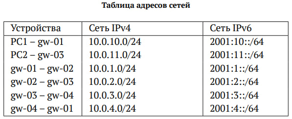{#fig:001 width=70%}

## Настройка динамической маршрутизации в сетях IPv4 и IPv6

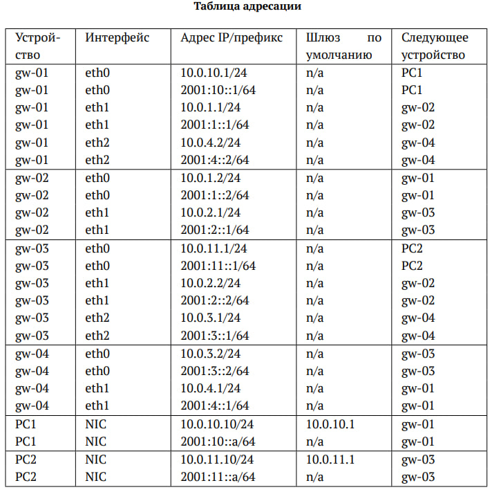{#fig:002 width=70%}

## Настройка динамической маршрутизации в сетях IPv4 и IPv6

{#fig:005 width=70%}

## Настройка динамической маршрутизации в сетях IPv4 и IPv6

Присвоим IPv4-адреса устройствам PC1 и PC2:

{#fig:006 width=70%}

## Настройка динамической маршрутизации в сетях IPv4 и IPv6

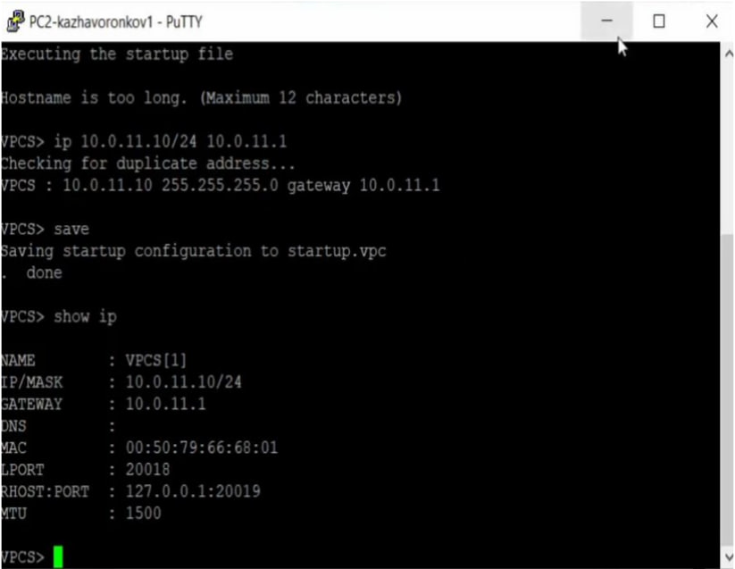{#fig:007 width=70%}

## Настройка динамической маршрутизации в сетях IPv4 и IPv6

Настроим IPv4-адреса на интерфейсах маршрутизаторов:

{#fig:008 width=70%}

## Настройка динамической маршрутизации в сетях IPv4 и IPv6

{#fig:009 width=70%}

## Настройка динамической маршрутизации в сетях IPv4 и IPv6

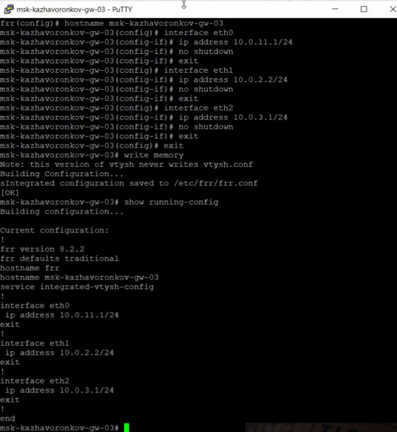{#fig:010 width=70%}

## Настройка динамической маршрутизации в сетях IPv4 и IPv6

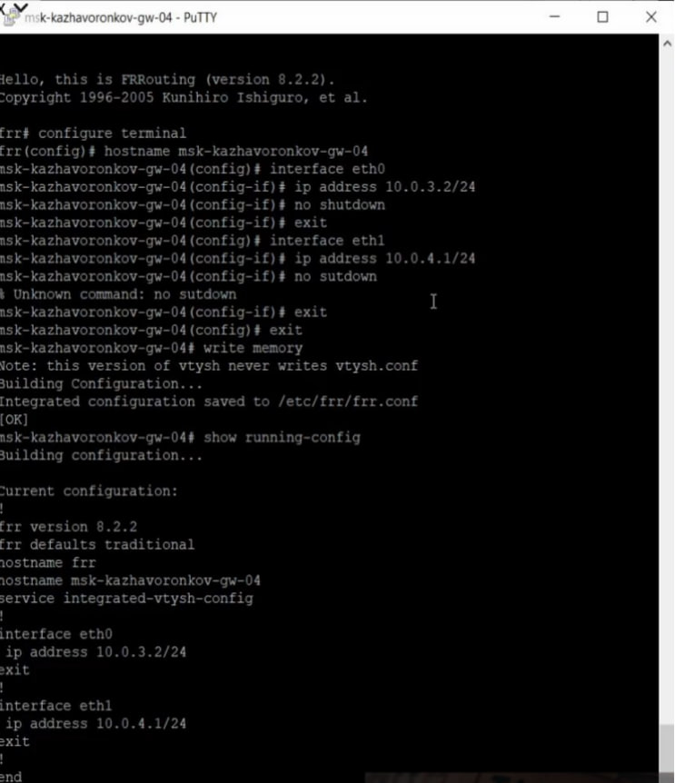{#fig:011 width=70%}

## Настройка динамической маршрутизации в сетях IPv4 и IPv6

Присвоим IPv6-адреса устройствам PC1 и PC2:

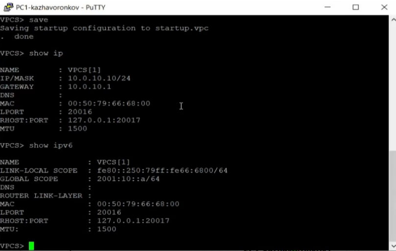{#fig:012 width=70%}

## Настройка динамической маршрутизации в сетях IPv4 и IPv6

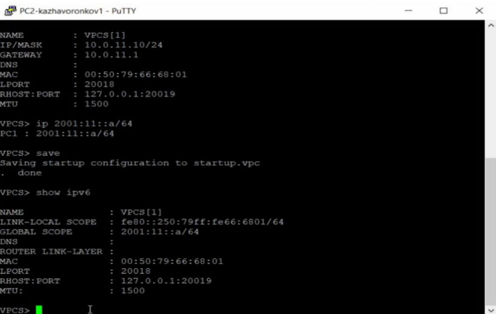{#fig:013 width=70%}

## Настройка динамической маршрутизации в сетях IPv4 и IPv6

Настроим IPv6-адреса на интерфейсах маршрутизаторов: (рис. 14-17)

{#fig:014 width=70%}

## Настройка динамической маршрутизации в сетях IPv4 и IPv6

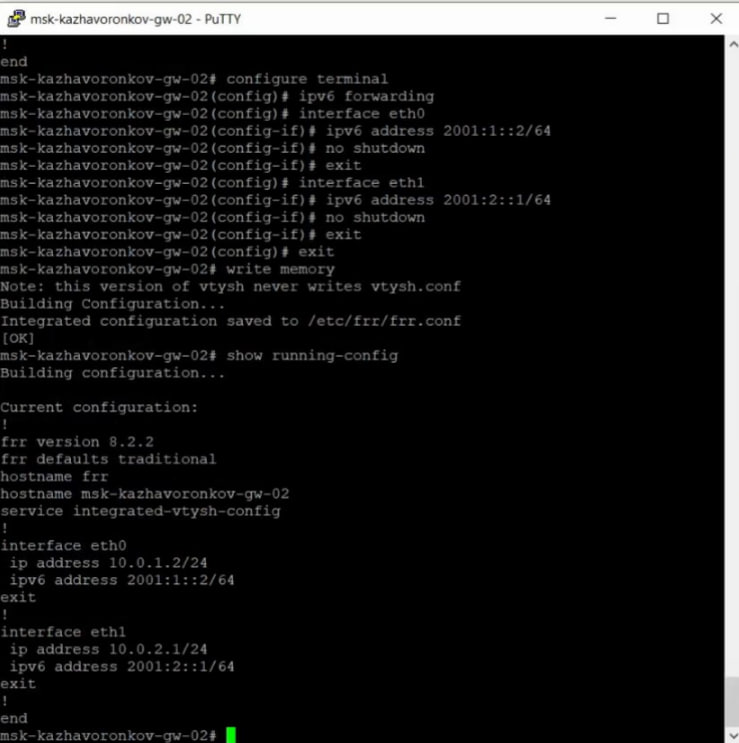{#fig:015 width=70%}

## Настройка динамической маршрутизации в сетях IPv4 и IPv6

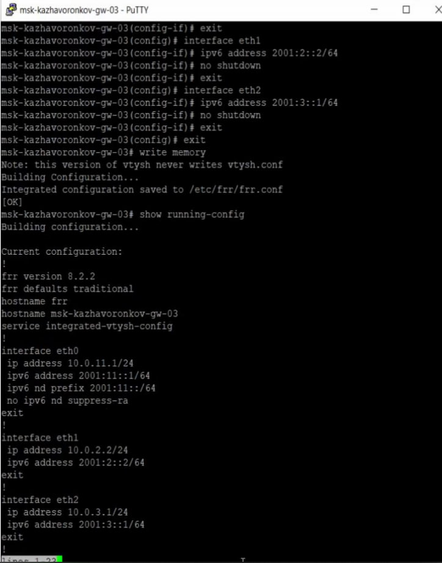{#fig:016 width=70%}

## Настройка динамической маршрутизации в сетях IPv4 и IPv6

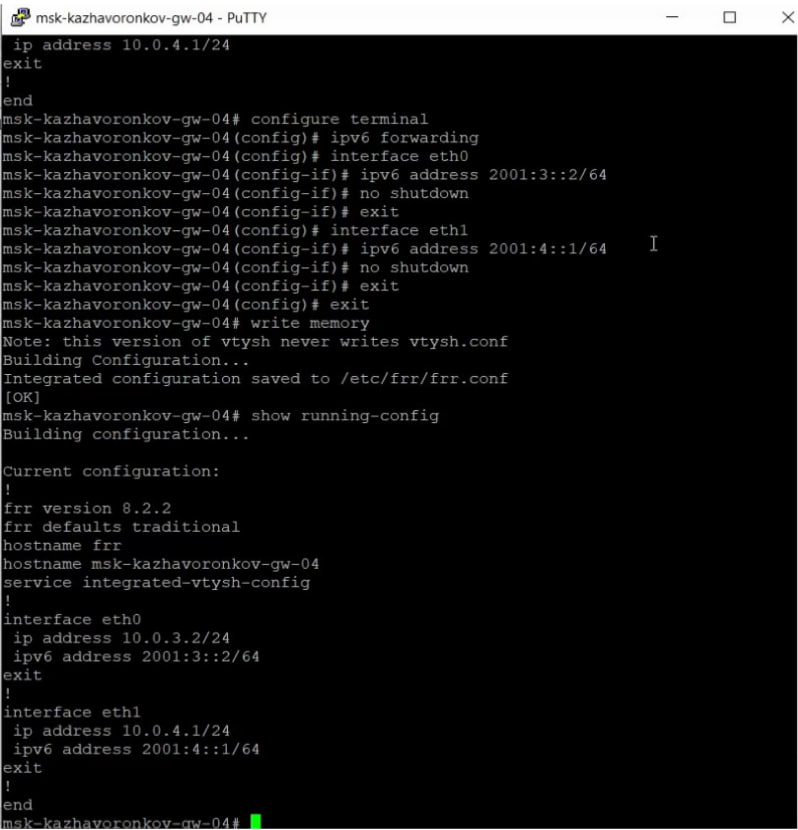{#fig:017 width=70%}

## Настройка динамической маршрутизации по протоколу RIP

На маршрутизаторах настроим RIP

{#fig:018 width=70%}

## Настройка динамической маршрутизации по протоколу RIP

{#fig:019 width=70%}

## Настройка динамической маршрутизации по протоколу RIP

{#fig:020 width=70%}

## Настройка динамической маршрутизации по протоколу RIP

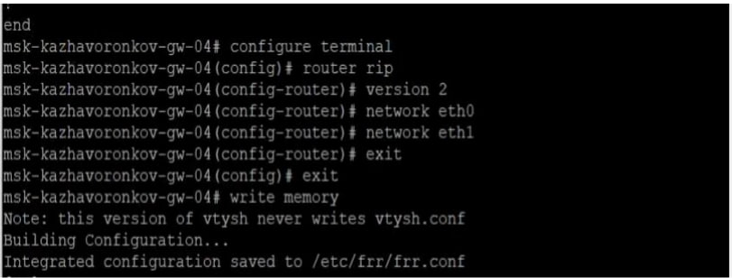{#fig:021 width=70%}

## Настройка динамической маршрутизации по протоколу RIP

Убедимся, что маршрутизация по RIP настроена:

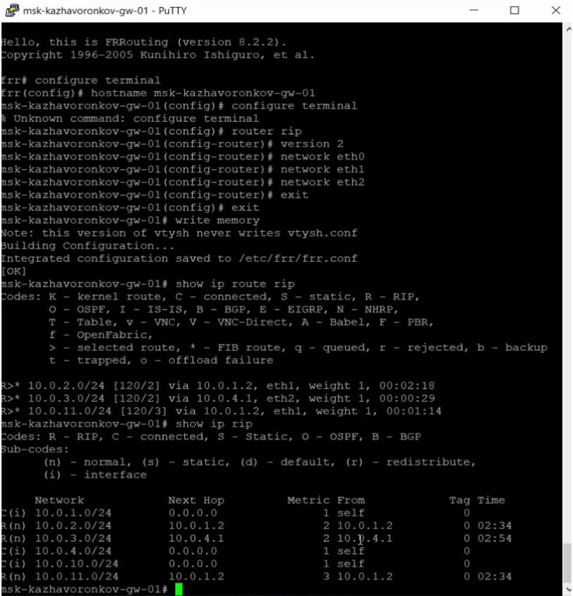{#fig:022 width=70%}

## Настройка динамической маршрутизации по протоколу RIP

{#fig:023 width=70%}

## Настройка динамической маршрутизации по протоколу RIP

{#fig:024 width=70%}

## Настройка динамической маршрутизации по протоколу RIP

{#fig:025 width=70%}

## Настройка динамической маршрутизации по протоколу RIP

Проверим метрики протокола RIP

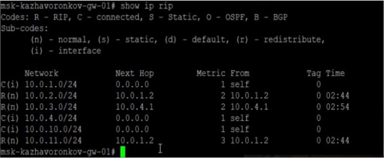{#fig:027 width=70%}

## Настройка динамической маршрутизации по протоколу RIP

Отключим на gw-02 интерфейс:

{#fig:028 width=70%}

## Настройка динамической маршрутизации по протоколу RIP

С PC1 пропингуем PC2. (рис. 31)

{#fig:031 width=70%}

## Настройка динамической маршрутизации по протоколу RIP

Посмотрим захваченный на соединениях трафик.

{#fig:032 width=70%}

## Настройка динамической маршрутизации по протоколу RIP

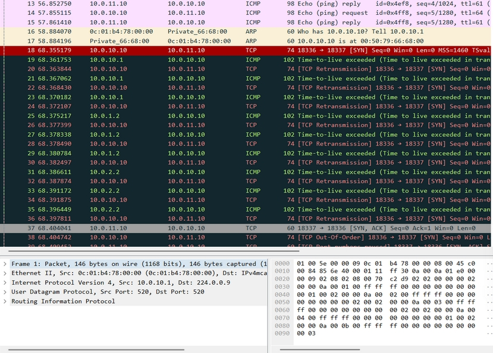{#fig:033 width=70%}

## Настройка динамической маршрутизации по протоколу RIP

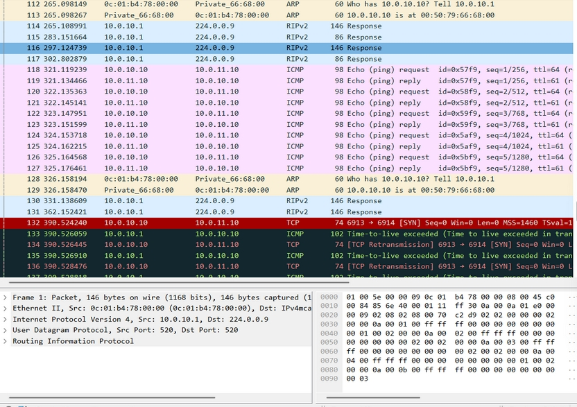{#fig:034 width=70%}

## Настройка динамической маршрутизации по протоколу RIP

На маршрутизаторах настроим RIjpg для сетей IPv6:

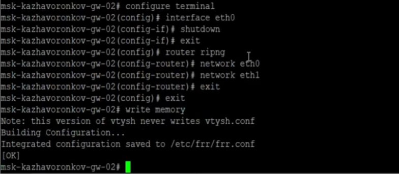{#fig:035 width=70%}

## Настройка динамической маршрутизации по протоколу RIP

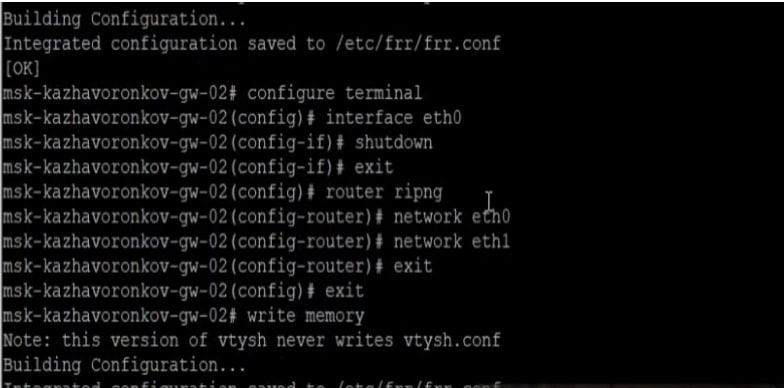{#fig:036 width=70%}

## Настройка динамической маршрутизации по протоколу RIP

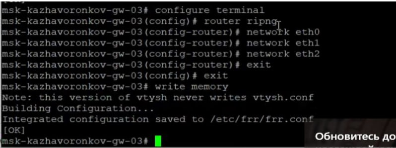{#fig:037 width=70%}

## Настройка динамической маршрутизации по протоколу RIP

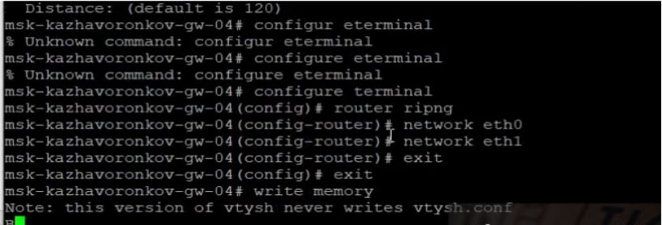{#fig:038 width=70%}

## Настройка динамической маршрутизации по протоколу RIP

С PC1 пропингуем PC2. Пакеты идут через gw-04.

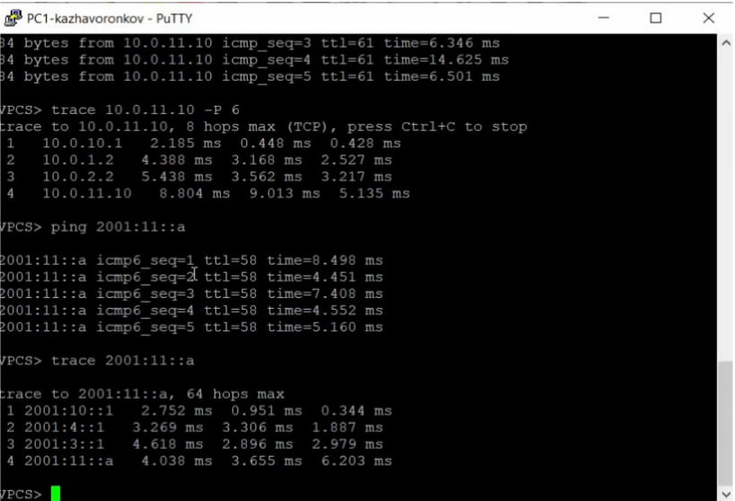{#fig:039 width=70%}

## Настройка динамической маршрутизации по протоколу RIP

Проверим метрики протокола RIjpg:

{#fig:040 width=70%}

## Настройка динамической маршрутизации по протоколу RIP

Пакет проходит через gw-04. Отключим на gw-04 интерфейс:

{#fig:041 width=70%}

## Настройка динамической маршрутизации по протоколу RIP

Проверим метрики протокола RIjpg:

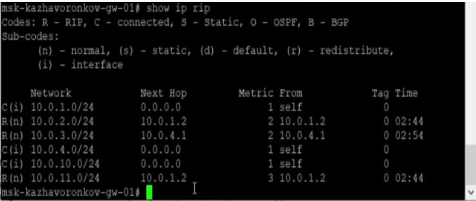{#fig:042 width=70%}

## Настройка динамической маршрутизации по протоколу RIP

С PC1 пропингуем PC2. Пакеты идут через gw-02.

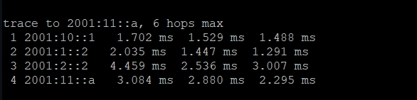{#fig:043 width=70%}

## Настройка динамической маршрутизации по протоколу RIP

{#fig:044 width=70%}

## Настройка динамической маршрутизации по протоколу RIP

С PC1 пропингуем PC2. Пакеты идут через gw-02.

{#fig:045 width=70%}

## Настройка динамической маршрутизации по протоколу RIP

Посмотрим захваченный на соединениях трафик

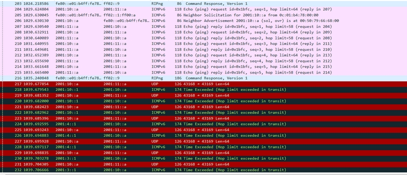{#fig:046 width=70%}

## Настройка динамической маршрутизации по протоколу RIP

{#fig:047 width=70%}

## Настройка динамической маршрутизации по протоколу OSPF

На маршрутизаторах настроим OSPFv2 для сетей IPv4:

{#fig:048 width=70%}

## Настройка динамической маршрутизации по протоколу OSPF

{#fig:049 width=70%}

## Настройка динамической маршрутизации по протоколу OSPF

{#fig:050 width=70%}

## Настройка динамической маршрутизации по протоколу OSPF

{#fig:051 width=70%}

## Настройка динамической маршрутизации по протоколу OSPF

С PC1 пропингуем PC2. Путь проходит через gw-04. (рис. 52)

{#fig:052 width=70%}

## Настройка динамической маршрутизации по протоколу OSPF

Проверим таблицу маршрутизации протокола OSPFv2: (рис. 53)

{#fig:053 width=70%}

## Настройка динамической маршрутизации по протоколу OSPF

Отключим на gw-04 интерфейс:

{#fig:054 width=70%}

## Настройка динамической маршрутизации по протоколу OSPF

Проверим таблицу маршрутизации протокола OSPFv2:

{#fig:055 width=70%}

## Настройка динамической маршрутизации по протоколу OSPF

Включим на маршрутизаторе gw-04 интерфейс:

{#fig:057 width=70%}

## Настройка динамической маршрутизации по протоколу OSPF

Посмотрим захваченный на соединениях трафик.

{#fig:059 width=70%}

## Настройка динамической маршрутизации по протоколу OSPF

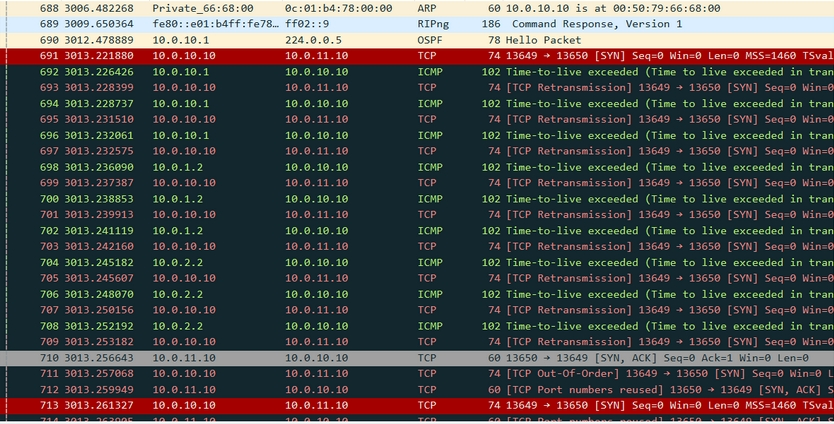{#fig:060 width=70%}

## Настройка динамической маршрутизации по протоколу OSPF

На маршрутизаторах настроим OSPFv3 для сетей IPv6:

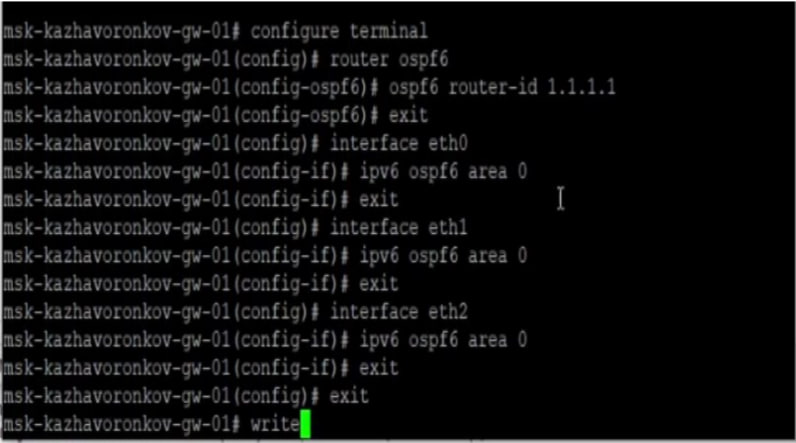{#fig:061 width=70%}

## Настройка динамической маршрутизации по протоколу OSPF

{#fig:062 width=70%}

## Настройка динамической маршрутизации по протоколу OSPF

{#fig:063 width=70%}

## Настройка динамической маршрутизации по протоколу OSPF

{#fig:064 width=70%}

## Настройка динамической маршрутизации по протоколу OSPF

С PC1 пропингуем PC2. Пакеты идут через gw-02

{#fig:065 width=70%}

## Настройка динамической маршрутизации по протоколу OSPF

Проверим таблицу маршрутизации протокола OSPFv3:

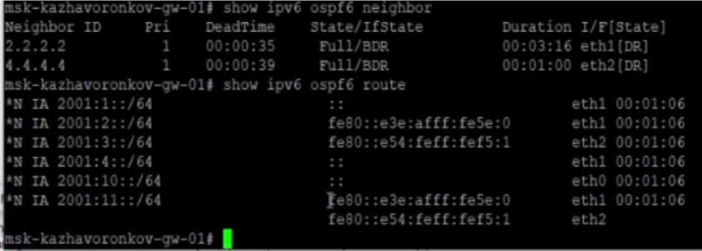{#fig:066 width=70%}

## Настройка динамической маршрутизации по протоколу OSPF

Пакет проходит через gw-02. Отключим на gw-02 интерфейс:

{#fig:067 width=70%}

## Настройка динамической маршрутизации по протоколу OSPF

Проверим таблицу маршрутизации протокола OSPFv3:

{#fig:068 width=70%}

## Настройка динамической маршрутизации по протоколу OSPF

С PC1 пропингуем PC2. Пакеты идут через gw-04.

{#fig:069 width=70%}

## Настройка динамической маршрутизации по протоколу OSPF

{#fig:070 width=70%}

## Настройка динамической маршрутизации по протоколу OSPF

С PC1 пропингуем PC2. Пакеты идут через gw-02.

{#fig:071 width=70%}

## Настройка динамической маршрутизации по протоколу OSPF

Посмотрим захваченный на соединениях трафик.

{#fig:072 width=70%}

## Настройка динамической маршрутизации по протоколу OSPF

{#fig:073 width=70%}

## Построение туннеля IPv6–IPv4

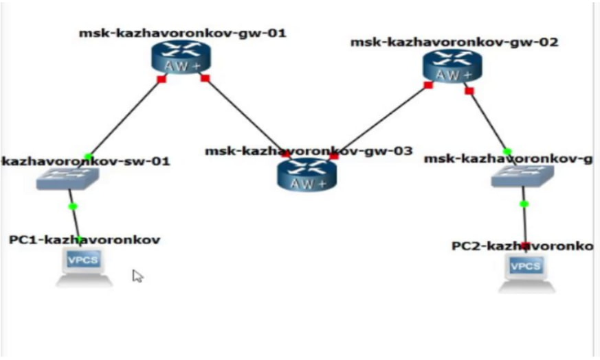{#fig:074 width=70%}

## Построение туннеля IPv6–IPv4

Присвоим адреса устройствам PC1 и PC2:

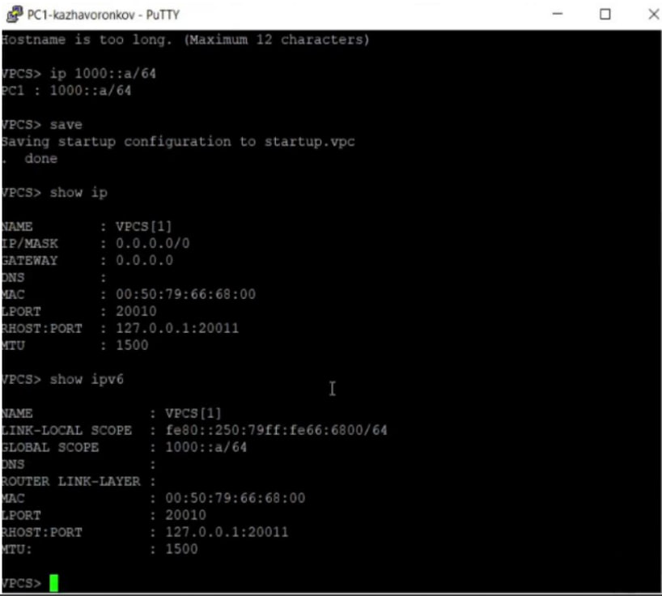{#fig:075 width=70%}

## Построение туннеля IPv6–IPv4

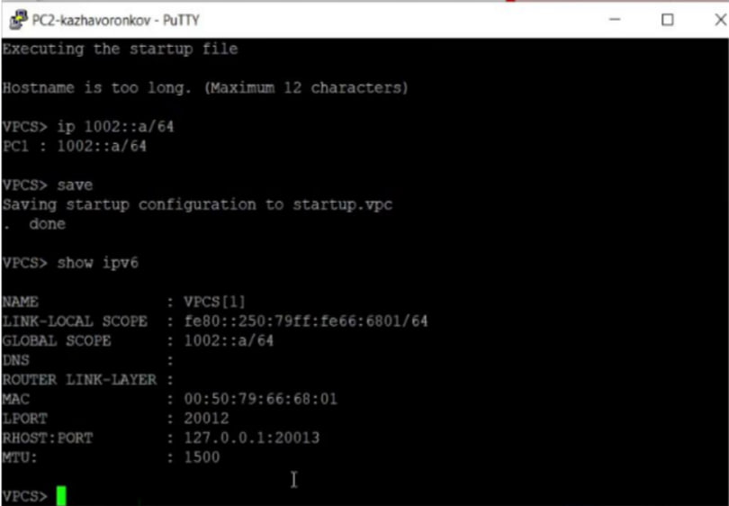{#fig:076 width=70%}

## Построение туннеля IPv6–IPv4

На маршрутизаторах настроим адреса на интерфейсах:

{#fig:077 width=70%}

## Построение туннеля IPv6–IPv4

{#fig:078 width=70%}

## Построение туннеля IPv6–IPv4

{#fig:079 width=70%}

## Построение туннеля IPv6–IPv4

Проверим маршруты с маршрутизатора R1:

{#fig:080 width=70%}

## Построение туннеля IPv6–IPv4

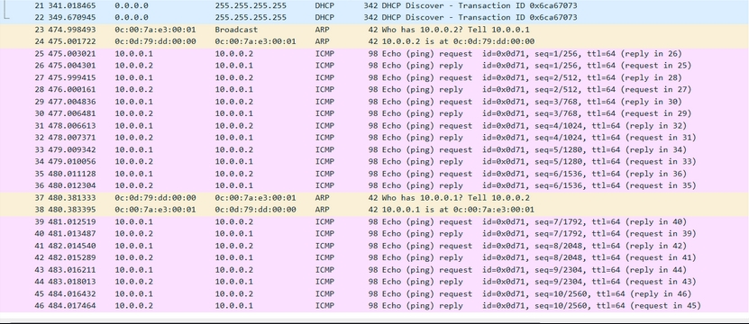{#fig:081 width=70%}

## Построение туннеля IPv6–IPv4

Настроим маршрутизацию IPv4: (рис. 82-84)

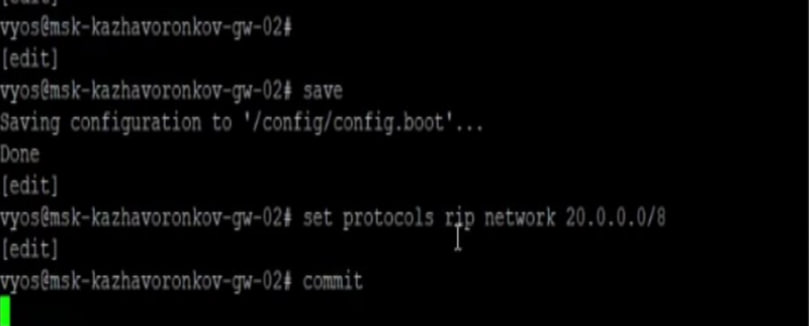{#fig:082 width=70%}

## Построение туннеля IPv6–IPv4

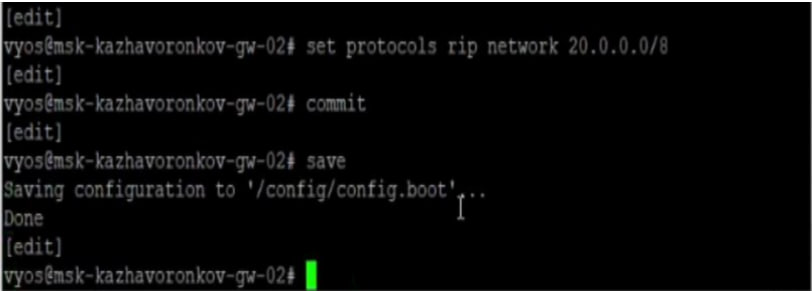{#fig:083 width=70%}

## Построение туннеля IPv6–IPv4

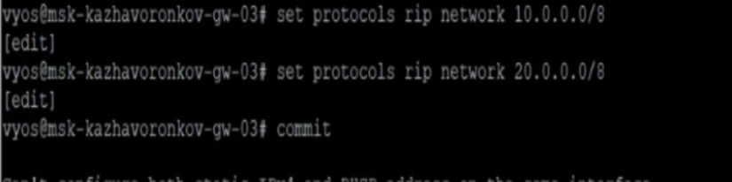{#fig:084 width=70%}

## Построение туннеля IPv6–IPv4

Проверим маршруты:

{#fig:085 width=70%}

## Построение туннеля IPv6–IPv4

{#fig:086 width=70%}

## Построение туннеля IPv6–IPv4

Создадим туннель IPv6 через сеть IPv4:

{#fig:087 width=70%}

## Построение туннеля IPv6–IPv4

{#fig:088 width=70%}

## Построение туннеля IPv6–IPv4

Настроим статическую маршрутизацию IPv6:

{#fig:089 width=70%}

## Построение туннеля IPv6–IPv4

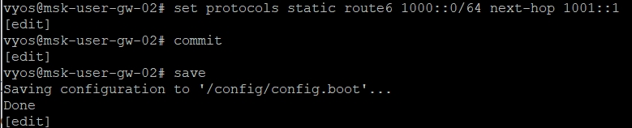{#fig:090 width=70%}

## Построение туннеля IPv6–IPv4

Проверим доступность оконечных устройств:

{#fig:091 width=70%}

## Построение туннеля IPv6–IPv4

{#fig:092 width=70%}

## Построение туннеля IPv6–IPv4

{#fig:093 width=70%}

## Построение туннеля IPv6–IPv4

{#fig:094 width=70%}

# Вывод

## Вывод

В ходе выполнения лабораторной работы мы изучили принципы маршрутизации в IPv4- и IPv6-сетях и принципов настройки сетевого оборудования.
